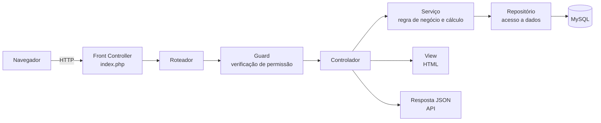

# Documentação do Projeto — Plataforma de Lojas

> **Disciplina de aplicação:** Matemática Financeira
> **Tema:** Aplicação web multi-loja para gestão comercial com módulo de Business Intelligence

---

## Sumário

1. [Introdução](#1-introdução)
   - [1.1 Contextualização](#11-contextualização)
   - [1.2 Problema](#12-problema)
   - [1.3 Justificativa](#13-justificativa)
   - [1.4 Objetivos](#14-objetivos)
   - [1.5 Delimitação do escopo](#15-delimitação-do-escopo)
2. [Referencial Teórico](#2-referencial-teórico)
   - [2.1 Fundamentação em Matemática Financeira](#21-fundamentação-em-matemática-financeira)
   - [2.2 Fundamentação Tecnológica](#22-fundamentação-tecnológica)
   - [2.3 Síntese do referencial](#23-síntese-do-referencial)
3. [Metodologia](#3-metodologia)
   - [3.1 Natureza e etapas do trabalho](#31-natureza-e-etapas-do-trabalho)
   - [3.2 Tecnologias utilizadas](#32-tecnologias-utilizadas)
   - [3.3 Arquitetura e design do projeto](#33-arquitetura-e-design-do-projeto)
   - [3.4 A interdisciplinaridade na prática](#34-a-interdisciplinaridade-na-prática)
   - [3.5 Procedimentos de validação](#35-procedimentos-de-validação)

---

# 1. Introdução

## 1.1 Contextualização

A **Matemática Financeira** é a disciplina que estuda o comportamento do dinheiro ao longo do tempo e as relações de proporção entre valores monetários. Seus conceitos fundamentais — razão e proporção, porcentagem, taxa de variação, média simples e ponderada, custo, receita, margem e lucro — são apresentados, em sala, sob a forma de exercícios pontuais: dado um preço de custo e uma margem desejada, calcule o preço de venda; dado o faturamento de dois meses, calcule a variação percentual.

O que raramente aparece no exercício é o que acontece quando essas mesmas fórmulas precisam operar **continuamente, sobre dados reais e em volume**. Um comerciante não calcula a margem de um produto: ele precisa da margem de duzentos produtos, atualizada a cada venda. Não compara dois valores de faturamento: compara séries de trinta dias, identifica quais itens perderam giro e decide onde investir. É nesse ponto que a Matemática Financeira deixa de ser uma conta e passa a ser um **sistema de informação**.

A tecnologia entra aqui como o instrumento que torna o conceito observável e verificável. Assim como um simulador permite ver uma trajetória física que a fórmula apenas descreve, um módulo de **Business Intelligence (BI)** permite *ver* a margem de lucro, a taxa de crescimento e o ticket médio — não como número isolado, mas como gráfico, comparação entre períodos e recomendação de decisão. A fórmula continua sendo a mesma; o que muda é que ela passa a ser aplicada automaticamente sobre cada venda registrada, e o seu resultado passa a ser lido visualmente.

Este projeto adota exatamente essa abordagem: uma plataforma web de comércio na qual **cada venda registrada alimenta um conjunto de indicadores financeiros calculados pelo próprio sistema**, apresentados no módulo *Analyzing BI*.

## 1.2 Problema

O pequeno comerciante costuma dominar a operação do seu negócio, mas não dispõe dos instrumentos para medi-lo financeiramente. Os problemas observados são de duas naturezas.

**Problemas de natureza matemático-financeira:**

- **Confusão entre faturamento e lucro.** O lojista sabe quanto entrou no caixa, mas não desconta sistematicamente o custo da mercadoria vendida. Vender mais passa a ser confundido com ganhar mais — inclusive nos casos em que o produto de maior saída é justamente o de menor margem.
- **Margem calculada "por alto".** Sem o preço de custo registrado ao lado do preço de venda, a margem unitária (`preço de venda − preço de custo`) não é calculável, e a formação de preço vira estimativa.
- **Média aritmética simples onde caberia média ponderada.** O preço médio de venda de um produto que foi vendido em promoção e em preço cheio não é a média dos dois preços: é a média **ponderada pelas quantidades**. Feito à mão, esse cálculo quase sempre sai errado.
- **Ausência de análise de variação percentual.** Comparar o mês atual com o mês anterior — a aplicação direta de `(Vf − Vi) / Vi` — é o instrumento mais simples de diagnóstico de tendência, e é justamente o que não se faz quando o controle é feito em caderno.
- **Decisão de investimento sem critério numérico.** Repor estoque, dar destaque na vitrine ou promover um item são decisões tomadas por percepção, e não a partir de indicadores de giro, margem e taxa de crescimento.

**Problemas de natureza operacional que impedem o cálculo:**

Nada disso é calculável se o dado de origem não existir ou não for confiável. E ele não é, porque o pequeno varejo opera com estoque divergente entre balcão e loja virtual, controle de caixa informal, e ausência de separação entre quem gerencia e quem apenas opera o negócio — o que compromete a rastreabilidade de toda movimentação financeira.

O problema, então, se enuncia em duas camadas: **é preciso, primeiro, capturar de forma íntegra e automática o dado de cada venda (valor, custo, quantidade, data, responsável); e, sobre esse dado, aplicar continuamente os instrumentos da Matemática Financeira, apresentando-os de forma visual e interpretável por quem não domina a formulação.**

## 1.3 Justificativa

**Justificativa disciplinar.** O projeto não ilustra a Matemática Financeira: ele a **executa**. Cada indicador do painel corresponde a uma fórmula implementada no código-fonte, o que permite verificar o conceito em três níveis — a fórmula matemática, a consulta que a calcula sobre os dados reais e o gráfico que a apresenta. O quadro abaixo relaciona os conceitos aos pontos onde eles são aplicados:

| Conceito de Matemática Financeira | Fórmula aplicada | Onde aparece no sistema |
|---|---|---|
| Receita bruta (faturamento) | `R = Σ total dos pedidos pagos` | Valor total e valor mensal |
| Custo da mercadoria vendida e lucro bruto | `L = Σ qᵢ · (pvᵢ − pcᵢ)` | Lucro estimado; lucro por produto |
| Margem de contribuição unitária | `m = pv − pc` | Ranking de lucratividade por produto |
| Média aritmética simples | `TM = R / n` (ticket médio) | Indicador de ticket médio |
| **Média ponderada** | `p̄ = Σ(qᵢ · pᵢ) / Σ qᵢ` | Preço médio de venda por produto |
| Variação percentual entre períodos | `i = (Vf − Vi) / Vi × 100` | Crescimento mês a mês; produto em alta e em queda |
| Análise horizontal (comparação de períodos) | mês corrente × mês anterior | Comparativo de vendas por produto |
| Regra de decisão por limiar proporcional | alerta se `q_atual < 25% · q_anterior` | Lista de produtos parados |
| Série temporal e tendência | faturamento por dia/mês (7d, 30d, 3m) | Gráfico de faturamento ao longo do tempo |
| Rateio proporcional | `meta individual = meta da loja / nº de funcionários` | Distribuição de metas para a equipe |
| Ponto de reposição | alerta se `estoque atual ≤ estoque mínimo` | Estoque crítico |
| Fluxo de caixa | saldo = abertura + entradas − saídas | Controle de caixa por turno |

**Justificativa técnica.** Os indicadores só têm valor se o dado for confiável. Por isso o sistema foi construído como uma base única: a venda no balcão e a venda pela internet gravam no mesmo estoque, sob a mesma transação, evitando a divergência que invalidaria qualquer cálculo posterior. O custo do produto é registrado no cadastro, tornando o lucro apurável desde a primeira venda.

**Justificativa econômica e de acesso.** O sistema roda sobre uma pilha gratuita e amplamente disponível (PHP, MySQL e Apache, no ambiente XAMPP), sem mensalidade e sem dependência obrigatória de serviços pagos. Sua arquitetura é **multi-loja**: uma única instalação atende diversas lojas independentes, cada uma com sua vitrine, sua equipe e seus próprios indicadores.

## 1.4 Objetivos

### 1.4.1 Objetivo Geral

Desenvolver uma **aplicação web multi-loja para gestão comercial** que registre de forma íntegra as operações de venda — pela vitrine na internet e pelo ponto de venda no balcão — e que aplique automaticamente sobre esses dados os instrumentos da Matemática Financeira, apresentando receita, custo, margem, lucro, ticket médio, taxa de variação e metas em um módulo de Business Intelligence com visualização gráfica e recomendações de decisão.

### 1.4.2 Objetivos Específicos

**Fundamentação e modelagem**

1. **Levantar os conceitos de Matemática Financeira** aplicáveis à gestão do varejo — porcentagem, razão e proporção, média simples e ponderada, taxa de variação, custo, receita, margem e lucro — e definir a fórmula de cada indicador a ser implementado.
2. **Modelar a base de dados relacional** de modo que todo indicador seja apurável, registrando explicitamente preço de venda, **preço de custo**, quantidade, data e responsável em cada item vendido.
3. **Definir a arquitetura da aplicação** em camadas (rotas → controladores → serviços → repositórios, sobre PDO/MySQL), isolando o cálculo financeiro na camada de serviço.

**Captura confiável do dado**

4. **Desenvolver a vitrine pública** da loja: catálogo, página de produto com variações de cor e tamanho, carrinho, checkout com retirada ou entrega, histórico de pedidos e endereços do cliente.
5. **Desenvolver o ponto de venda (PDV)** e o **controle de caixa** por turno, com registro de abertura, fechamento, entradas e saídas, apurando o saldo do período.
6. **Implementar o registro de pagamento** em três modalidades (dinheiro, cartão e PIX), com confirmação sujeita a permissão. *(Ver delimitação em 1.5.)*
7. **Garantir a integridade do estoque** por variação de produto, com transações e bloqueio de linha, impedindo que vendas simultâneas pela vitrine e pelo PDV produzam quantidade negativa — condição necessária para que os indicadores reflitam a realidade.
8. **Implementar o controle de acesso** por matriz de permissões nomeadas por cargo, com negação por padrão, distinguindo quem gerencia (acesso aos indicadores financeiros e à formação de preço) de quem apenas opera a loja.

**Aplicação da Matemática Financeira — módulo *Analyzing BI***

9. **Implementar o cálculo da receita bruta** total e mensal a partir dos pedidos efetivamente pagos.
10. **Implementar o cálculo do lucro** pela fórmula `Σ quantidade × (preço de venda − preço de custo)`, apurado tanto de forma global quanto individualizada por produto.
11. **Implementar o ticket médio** como média aritmética entre receita total e número de pedidos, e o **preço médio de venda** como **média ponderada** pelas quantidades vendidas.
12. **Implementar a análise de variação percentual** entre o mês corrente e o mês anterior, aplicada ao faturamento e ao volume vendido por produto, identificando o item de maior crescimento e o de maior queda.
13. **Implementar a detecção de produtos parados** por regra de limiar proporcional, sinalizando itens cujo volume no mês corrente caiu abaixo de 25% do volume do mês anterior.
14. **Construir a série temporal de faturamento** com granularidade diária e mensal nos períodos de 7 dias, 30 dias e 3 meses, com preenchimento dos dias sem venda, e prever a estrutura para a futura linha de tendência.
15. **Implementar o módulo de metas** da loja e por funcionário, com rateio proporcional da meta global entre a equipe e acompanhamento do percentual atingido.
16. **Desenvolver a apresentação gráfica** dos indicadores em painel configurável, traduzindo cada resultado numérico em leitura visual e em recomendações objetivas de decisão (repor estoque, promover item, revisar preço).

**Validação e documentação**

17. **Validar os cálculos** confrontando os resultados apresentados pelo painel com a apuração manual sobre um conjunto de dados de exemplo.
18. **Documentar** a instalação, a configuração, a arquitetura e a formulação matemática de cada indicador, registrando as limitações conhecidas e o plano de evolução.

## 1.5 Delimitação do escopo

Registram-se três limites que definem com precisão o alcance do trabalho:

1. **O processamento de pagamento é simulado.** O sistema modela integralmente o ciclo financeiro do pagamento — registro, confirmação, baixa de estoque e reflexo na receita e no lucro —, mas não se integra a um provedor de pagamentos real. O uso comercial efetivo exige essa integração.
2. **Os indicadores operam sobre valores nominais.** O escopo atual cobre os conceitos de proporção, porcentagem, média e taxa de variação. Instrumentos de Matemática Financeira que envolvem o **valor do dinheiro no tempo** — juros simples e compostos, desconto, parcelamento com acréscimo, valor presente líquido e taxa interna de retorno — não são aplicados nesta versão e constituem a principal frente de ampliação do trabalho.
3. **A projeção de tendência ainda não é calculada.** A estrutura da série de previsão está prevista e reservada no módulo de faturamento, mas o cálculo de tendência (por exemplo, por média móvel ou regressão linear) permanece como trabalho futuro.

---

# 2. Referencial Teórico

Este capítulo reúne a base conceitual que sustenta o trabalho. Ele está dividido em duas frentes: a **fundamentação em Matemática Financeira**, que fornece as fórmulas e os critérios de análise; e a **fundamentação tecnológica**, que fornece os meios para que essas fórmulas sejam aplicadas de forma automática, confiável e repetível sobre dados reais.

---

## 2.1 Fundamentação em Matemática Financeira

### 2.1.1 Origem e objeto de estudo

A Matemática Financeira nasce de uma necessidade prática muito antiga: representar numericamente o valor de uma dívida, de um empréstimo ou de uma mercadoria ao longo do tempo. Registros de cobrança de juros aparecem já nas civilizações da Mesopotâmia, em tábuas de argila que descrevem empréstimos de grãos e de prata com acréscimo proporcional ao prazo.

Dois marcos costumam ser citados na formalização do campo. O primeiro é o *Liber Abaci*, publicado por **Leonardo de Pisa (Fibonacci)** em 1202, que introduziu na Europa o sistema de numeração indo-arábico e apresentou problemas de câmbio, de juros e de repartição proporcional resolvidos por métodos aritméticos. O segundo é a *Summa de Arithmetica*, de **Luca Pacioli** (1494), que sistematizou o método das partidas dobradas — a base da contabilidade moderna e, por consequência, da apuração de receita, custo e resultado.

A Matemática Financeira tem por objeto de estudo, portanto, **as relações entre quantias monetárias, taxas percentuais e o tempo**. Autores de referência na literatura brasileira, como Hazzan e Pompeo e Assaf Neto, organizam esse objeto em torno de quatro grandezas fundamentais:

| Grandeza | Símbolo | Significado |
|---|---|---|
| Capital (ou valor presente) | `C` ou `VP` | Quantia inicial aplicada, emprestada ou investida |
| Taxa de juros | `i` | Percentual de remuneração do capital por período |
| Prazo | `n` | Número de períodos de aplicação |
| Montante (ou valor futuro) | `M` ou `VF` | Quantia acumulada ao final do prazo |
| Juros | `J` | Diferença entre o montante e o capital: `J = M − C` |

### 2.1.2 Razão, proporção e porcentagem

Toda a Matemática Financeira se apoia em uma operação elementar: a **razão** entre duas quantidades. Uma razão expressa quantas vezes uma grandeza cabe na outra, e a **proporção** é a igualdade entre duas razões — o instrumento com que se resolvem problemas de regra de três e de repartição.

A **porcentagem** é um caso particular de razão, cujo denominador é fixado em 100:

```
x% = x / 100
```

Duas formas de aplicação são especialmente relevantes na gestão comercial:

- **Acréscimo:** aplicar um aumento de `i` sobre um valor `V` resulta em `V · (1 + i)`. Um aumento de 20% sobre R$ 80,00 produz `80 × 1,20 = R$ 96,00`.
- **Decréscimo:** aplicar um desconto de `i` resulta em `V · (1 − i)`. Um desconto de 15% sobre R$ 200,00 produz `200 × 0,85 = R$ 170,00`.

É importante observar que **acréscimos e descontos sucessivos não se somam**: um aumento de 10% seguido de outro de 10% não equivale a 20%, mas a `1,10 × 1,10 = 1,21`, isto é, 21%. Esse comportamento multiplicativo é justamente o princípio que dá origem ao regime de juros compostos.

### 2.1.3 Taxa de variação percentual

A taxa de variação mede, em termos relativos, quanto uma grandeza mudou entre dois momentos. Sendo `Vi` o valor inicial e `Vf` o valor final:

```
        Vf − Vi
i  =  ───────────  × 100
          Vi
```

**Exemplo.** Um estabelecimento faturou R$ 8.000,00 em um mês e R$ 9.200,00 no mês seguinte. A variação é:

```
i = (9.200 − 8.000) / 8.000 × 100 = 0,15 × 100 = 15%
```

Trata-se do instrumento básico da **análise horizontal**, técnica contábil que compara a mesma rubrica em períodos sucessivos para identificar tendência de crescimento ou de retração. Note-se que a fórmula é indefinida quando `Vi = 0`, situação que exige tratamento convencionado à parte — um detalhe teórico com consequências diretas quando o cálculo é automatizado.

### 2.1.4 Juros simples

No **regime de juros simples**, o juro de cada período incide sempre sobre o capital inicial, sem incorporar os juros já acumulados. O crescimento é, portanto, **linear** (uma progressão aritmética):

```
J = C · i · n
M = C · (1 + i · n)
```

**Exemplo.** Um capital de R$ 1.000,00 aplicado à taxa de 2% ao mês durante 12 meses:

```
J = 1.000 × 0,02 × 12 = R$ 240,00
M = 1.000 × (1 + 0,24) = R$ 1.240,00
```

O regime simples é hoje pouco usado em operações financeiras de prazo longo, mas permanece presente em multas, em juros de mora de curto prazo e em situações contratuais específicas.

### 2.1.5 Juros compostos

No **regime de juros compostos**, o juro de cada período passa a integrar o capital do período seguinte — o chamado "juro sobre juro", ou capitalização. O crescimento deixa de ser linear e torna-se **exponencial** (uma progressão geométrica). A fórmula fundamental é:

```
M = C · (1 + i)ⁿ
```

e, por consequência:

```
J = M − C = C · [ (1 + i)ⁿ − 1 ]
```

**Dedução.** Ao fim do primeiro período, o montante é `C(1+i)`. Como esse valor passa a ser o capital do segundo período, ao fim dele tem-se `C(1+i)·(1+i) = C(1+i)²`. Repetindo o raciocínio por `n` períodos, chega-se a `C(1+i)ⁿ`.

**Exemplo comparativo.** O mesmo capital de R$ 1.000,00, à mesma taxa de 2% ao mês, pelos mesmos 12 meses:

```
M = 1.000 × (1,02)¹² = 1.000 × 1,268242 = R$ 1.268,24
J = R$ 268,24
```

Contra os R$ 240,00 do regime simples, a diferença é de R$ 28,24 — e ela **cresce mais que proporcionalmente** com o prazo. Em 60 meses, o regime simples produziria R$ 2.200,00, enquanto o composto produziria `1.000 × (1,02)⁶⁰ ≈ R$ 3.281,03`.

As demais grandezas são obtidas por manipulação algébrica da fórmula fundamental:

| Incógnita | Fórmula |
|---|---|
| Capital | `C = M / (1 + i)ⁿ` |
| Taxa | `i = (M / C)^(1/n) − 1` |
| Prazo | `n = log(M / C) / log(1 + i)` |

### 2.1.6 Taxas equivalentes e taxa efetiva

Duas taxas são **equivalentes** quando, aplicadas ao mesmo capital por prazos de mesma duração total, produzem o mesmo montante. Em juros compostos, a conversão entre períodos obedece a:

```
(1 + i_maior) = (1 + i_menor)^k
```

onde `k` é o número de períodos menores contidos no maior. Assim, uma taxa de 2% ao mês equivale, ao ano, a:

```
i_anual = (1,02)¹² − 1 = 0,268242 → 26,82% ao ano
```

e **não** a 24% (que seria a taxa *nominal*, obtida por simples multiplicação). A distinção entre **taxa nominal** e **taxa efetiva** é um dos pontos de maior importância prática da disciplina, pois é onde se concentra a diferença entre o custo anunciado e o custo real de uma operação.

### 2.1.7 Valor do dinheiro no tempo

Da capitalização decorre o princípio central da disciplina: **uma quantia disponível hoje não equivale à mesma quantia disponível no futuro**. Para comparar valores situados em datas diferentes, é preciso transportá-los a uma data focal comum, por meio das operações de capitalização (levar ao futuro) e de **desconto** (trazer ao presente):

```
VP = VF / (1 + i)ⁿ
```

Sobre esse princípio se constroem os critérios clássicos de análise de investimento:

- **Valor Presente Líquido (VPL):** soma dos fluxos de caixa futuros trazidos a valor presente, deduzido o investimento inicial. Um projeto é considerado viável quando `VPL > 0`.

```
VPL = −I₀ + Σ [ FCₜ / (1 + i)ᵗ ]
```

- **Taxa Interna de Retorno (TIR):** a taxa `i` que anula o VPL, isto é, que iguala o valor presente das entradas ao das saídas. Compara-se a TIR ao custo de oportunidade do capital para decidir sobre o investimento.

### 2.1.8 Médias: simples e ponderada

A **média aritmética simples** de um conjunto de `n` valores é a soma dividida pela quantidade:

```
x̄ = (x₁ + x₂ + ... + xₙ) / n
```

A **média aritmética ponderada** atribui a cada valor um peso `pᵢ` correspondente à sua importância relativa:

```
        Σ (xᵢ · pᵢ)
x̄ₚ  =  ─────────────
          Σ pᵢ
```

A distinção é decisiva na análise comercial. Suponha-se um produto vendido em duas condições: **10 unidades a R$ 50,00** e **30 unidades a R$ 40,00**. A média simples dos preços seria `(50 + 40) / 2 = R$ 45,00` — resultado incorreto, pois ignora que a maior parte das unidades saiu pelo preço menor. A média ponderada pelas quantidades fornece o preço médio real de venda:

```
x̄ₚ = (10 × 50 + 30 × 40) / (10 + 30) = 1.700 / 40 = R$ 42,50
```

O erro de R$ 2,50 por unidade, replicado sobre todo o volume vendido, distorce diretamente a apuração de margem e de lucro.

### 2.1.9 Custo, receita, lucro e margem

A apuração do resultado de uma operação comercial parte de três grandezas:

- **Receita bruta (R):** o total faturado, dado pelo somatório de `preço de venda × quantidade` de cada item vendido.
- **Custo da mercadoria vendida (CMV):** o somatório de `preço de custo × quantidade` dos mesmos itens.
- **Lucro bruto (L):** a diferença entre ambos.

```
L = R − CMV = Σ qᵢ · (pvᵢ − pcᵢ)
```

A diferença unitária `pv − pc` é a **margem de contribuição unitária**: o quanto cada unidade vendida contribui para cobrir os custos fixos e, superado esse ponto, para formar lucro.

Um cuidado teórico frequentemente negligenciado é a distinção entre **markup** e **margem**, que usam o mesmo numerador mas bases diferentes:

| Indicador | Fórmula | Exemplo (`pc = 60`, `pv = 100`) |
|---|---|---|
| Markup (margem sobre o custo) | `(pv − pc) / pc` | `40 / 60 = 66,67%` |
| Margem (sobre o preço de venda) | `(pv − pc) / pv` | `40 / 100 = 40,00%` |

Confundir as duas bases é uma das causas mais comuns de erro na formação de preço no pequeno comércio.

### 2.1.10 Ponto de equilíbrio

O **ponto de equilíbrio** (ou *break-even point*) é a quantidade de unidades que precisa ser vendida para que a receita total iguale o custo total — ou seja, para que o lucro seja nulo. Sendo `CF` o custo fixo do período, `pv` o preço de venda unitário e `cv` o custo variável unitário:

```
              CF
PE  =  ─────────────────
          pv − cv
```

**Exemplo.** Custo fixo mensal de R$ 3.000,00, preço de venda de R$ 50,00 e custo variável de R$ 30,00 por unidade:

```
PE = 3.000 / (50 − 30) = 3.000 / 20 = 150 unidades
```

Abaixo de 150 unidades no mês, a operação opera com prejuízo; acima, cada unidade adicional contribui com R$ 20,00 de lucro.

### 2.1.11 Indicadores de desempenho aplicados ao varejo

Sobre as grandezas anteriores constrói-se um conjunto de indicadores de gestão amplamente utilizado no comércio:

| Indicador | Fórmula | O que informa |
|---|---|---|
| **Ticket médio** | `TM = receita total / nº de vendas` | Valor médio gasto por compra |
| **Giro de estoque** | `G = CMV / estoque médio` | Quantas vezes o estoque se renova no período |
| **Cobertura de estoque** | `nº de dias do período / G` | Por quantos dias o estoque atual sustenta a venda |
| **Ponto de reposição** | alerta quando `estoque ≤ estoque mínimo` | Momento de recomprar para não faltar produto |
| **Participação no faturamento** | `receita do item / receita total` | Peso relativo de cada produto |

A esses indicadores costuma-se associar a **Curva ABC**, aplicação comercial do princípio de Pareto: ordenados os produtos por participação decrescente no faturamento, verifica-se com frequência que uma minoria de itens (classe A) responde pela maior parte do resultado, enquanto uma maioria de itens (classe C) responde por uma fração pequena. A classificação orienta onde concentrar estoque, atenção e investimento.

### 2.1.12 Séries temporais e tendência

Quando um indicador é observado repetidamente ao longo do tempo, forma-se uma **série temporal**. Sua análise permite distinguir a **tendência** (o movimento de fundo, de alta ou de baixa), a **sazonalidade** (variações que se repetem em ciclos regulares) e as **oscilações irregulares**.

A técnica mais elementar de suavização é a **média móvel simples de ordem k**, que substitui cada ponto pela média dos `k` períodos anteriores, reduzindo o ruído e evidenciando a tendência:

```
MMₜ = (xₜ + xₜ₋₁ + ... + xₜ₋ₖ₊₁) / k
```

Para projeção, recorre-se comumente ao **ajuste de uma reta de tendência** pelo método dos mínimos quadrados, que determina os coeficientes `a` e `b` da equação `y = a + b·x` minimizando a soma dos quadrados dos desvios entre os valores observados e os estimados.

### 2.1.13 Repartição proporcional

Por fim, um instrumento clássico da disciplina, aplicado à definição de metas e à distribuição de resultados: a **divisão proporcional**. Dado um total `T` a ser repartido entre `n` participantes segundo pesos `pᵢ`, a parte de cada um é:

```
          pᵢ
Pᵢ  =  ──────── · T
         Σ pⱼ
```

Quando todos os pesos são iguais, o caso se reduz à **divisão em partes iguais**, `T / n` — a forma mais simples de rateio de uma meta coletiva entre os membros de uma equipe.

---

## 2.2 Fundamentação Tecnológica

### 2.2.1 Aplicação web e o modelo cliente-servidor

Uma **aplicação web** é um programa que não se instala no equipamento do usuário: ele é executado em um servidor e acessado por meio de um navegador. Esse arranjo segue o **modelo cliente-servidor**, no qual um dos programas (o cliente) solicita, e o outro (o servidor) processa e responde.

A comunicação entre eles é regida pelo protocolo **HTTP** (*HyperText Transfer Protocol*), cujo funcionamento se dá em ciclos independentes de **requisição e resposta**. Cada requisição carrega um **método**, que declara a intenção da operação, e um **caminho**, que identifica o recurso:

| Método | Intenção |
|---|---|
| `GET` | Obter um recurso, sem alterá-lo |
| `POST` | Criar um recurso ou submeter dados |
| `PUT` / `PATCH` | Atualizar um recurso existente |
| `DELETE` | Remover um recurso |

A resposta traz um **código de estado** que informa o desfecho: a faixa `2xx` indica sucesso, `3xx` redirecionamento, `4xx` erro atribuível ao cliente (como `404`, recurso inexistente, ou `403`, acesso negado) e `5xx` falha no servidor.

Uma característica determinante do HTTP é ser **sem estado** (*stateless*): o protocolo não guarda memória entre uma requisição e a seguinte. Como uma aplicação de gestão precisa saber quem está conectado, recorre-se ao mecanismo de **sessão**, no qual o servidor armazena os dados do usuário autenticado e entrega ao navegador apenas um identificador, transportado em um *cookie* e reenviado a cada requisição.

Convencionou-se dividir o desenvolvimento em duas frentes: o **front-end**, que trata da interface exibida ao usuário, e o **back-end**, que trata do processamento, das regras de negócio e do acesso aos dados.

### 2.2.2 A linguagem PHP

**PHP** (*PHP: Hypertext Preprocessor*) é uma linguagem de programação **interpretada** e de **execução no servidor**, criada por Rasmus Lerdorf em 1995 e voltada especificamente ao desenvolvimento web. Ser interpretada significa que o código-fonte é lido e executado diretamente por um interpretador, sem etapa prévia de compilação em arquivo executável; ser executada no servidor significa que o usuário jamais recebe o código, apenas o resultado que ele produziu — em geral, um documento HTML ou um documento de dados.

A partir da versão 5, e de forma consolidada na versão 8, o PHP oferece suporte completo à **programação orientada a objetos (POO)**, paradigma no qual o programa é organizado em **classes** — moldes que reúnem dados (atributos) e comportamentos (métodos) — a partir das quais se criam **objetos**. Os recursos centrais desse paradigma são:

- **Encapsulamento:** restringir o acesso direto aos dados internos de um objeto, expondo apenas operações controladas.
- **Herança:** permitir que uma classe reaproveite e especialize o comportamento de outra.
- **Polimorfismo:** permitir que objetos de classes distintas respondam à mesma chamada de maneiras próprias.
- **Namespaces:** organizar as classes em espaços de nomes, evitando conflitos de identificadores.
- **Tipagem declarada:** anotar os tipos esperados de parâmetros e de retornos, permitindo que erros sejam detectados mais cedo.

A adoção do PHP no ambiente educacional e no pequeno negócio se explica pela sua disponibilidade: ele integra pacotes gratuitos como o **XAMPP**, que reúne em uma única instalação o servidor web **Apache**, o interpretador PHP e o banco de dados **MySQL** — reproduzindo localmente, sem custo, a mesma pilha usada em hospedagens comerciais.

### 2.2.3 Tecnologias de interface: HTML, CSS e JavaScript

Do lado do navegador, três tecnologias se complementam:

- **HTML** (*HyperText Markup Language*) é a linguagem de marcação que define a **estrutura** do documento: títulos, parágrafos, tabelas, formulários. Ao interpretá-lo, o navegador constrói o **DOM** (*Document Object Model*), uma representação do documento em forma de árvore de objetos.
- **CSS** (*Cascading Style Sheets*) descreve a **apresentação**: cores, espaçamentos, tipografia e comportamento responsivo em diferentes tamanhos de tela.
- **JavaScript** é a linguagem de programação executada **no navegador**, responsável pelo **comportamento**: reagir a ações do usuário, alterar o DOM sem recarregar a página e solicitar dados ao servidor em segundo plano.

Essa última capacidade se dá por meio de **requisições assíncronas** — hoje realizadas pela interface `fetch` —, nas quais o navegador pede dados ao servidor e continua responsivo enquanto aguarda a resposta. É esse mecanismo que permite construir painéis que se atualizam sem interromper a navegação, característica essencial em interfaces analíticas.

### 2.2.4 Banco de dados e o modelo relacional

Um **banco de dados** é uma coleção organizada de dados persistentes, isto é, que sobrevivem ao encerramento do programa. O software que o administra chama-se **SGBD** (Sistema de Gerenciamento de Banco de Dados), e cabe a ele armazenar, recuperar, proteger e garantir a consistência desses dados.

O **modelo relacional**, proposto por **Edgar F. Codd** em 1970 no artigo *A Relational Model of Data for Large Shared Data Banks*, organiza a informação em **relações** — usualmente apresentadas como **tabelas**, compostas por **colunas** (os atributos, cada uma com um tipo de dado) e **linhas** (os registros). Seus elementos estruturais são:

- **Chave primária:** coluna, ou conjunto de colunas, que identifica univocamente cada linha da tabela.
- **Chave estrangeira:** coluna que referencia a chave primária de outra tabela, estabelecendo o vínculo entre entidades e garantindo a **integridade referencial** — isto é, impedindo que exista um registro filho apontando para um registro pai inexistente.
- **Cardinalidade:** a natureza do relacionamento entre duas entidades (um-para-um, um-para-muitos, muitos-para-muitos).

A **normalização** é o processo de decompor tabelas de modo a eliminar redundância e evitar anomalias de inserção, atualização e exclusão. As três primeiras formas normais exigem, respectivamente: que cada campo contenha um valor atômico; que todo atributo não-chave dependa da chave primária inteira; e que nenhum atributo não-chave dependa de outro atributo não-chave.

### 2.2.5 SQL e as operações de agregação

A linguagem **SQL** (*Structured Query Language*) é o meio padronizado de interação com bancos relacionais. Costuma ser dividida em subconjuntos conforme a finalidade: **DDL**, para definir a estrutura (`CREATE`, `ALTER`, `DROP`); **DML**, para manipular os dados (`INSERT`, `UPDATE`, `DELETE`); e **DQL**, para consultá-los (`SELECT`).

Para a análise financeira, dois recursos do SQL são particularmente relevantes.

O primeiro é a **junção** (`JOIN`), que combina linhas de tabelas diferentes a partir de uma condição de correspondência — por exemplo, associar cada item vendido ao cadastro do produto, para que o preço praticado na venda possa ser confrontado com o custo registrado.

O segundo são as **funções de agregação**, que condensam um conjunto de linhas em um único valor:

| Função | Resultado | Correspondência matemática |
|---|---|---|
| `SUM(x)` | Soma dos valores | Somatório `Σ x` |
| `COUNT(*)` | Contagem de linhas | Cardinalidade `n` |
| `AVG(x)` | Média aritmética | `Σx / n` |
| `MIN(x)` / `MAX(x)` | Menor e maior valor | Extremos do conjunto |

Combinadas à cláusula `GROUP BY`, que particiona o conjunto em grupos, essas funções permitem que uma única consulta calcule um indicador para cada produto, cada mês ou cada vendedor. É importante notar a correspondência conceitual: **uma fórmula de somatório da Matemática Financeira encontra tradução direta em uma consulta de agregação**, e a média ponderada, em particular, expressa-se como o quociente entre dois somatórios — `SUM(quantidade * preço) / SUM(quantidade)`.

### 2.2.6 Transações, propriedades ACID e concorrência

Uma **transação** é uma sequência de operações tratada como unidade indivisível: ou todas se efetivam (`COMMIT`), ou nenhuma se efetiva (`ROLLBACK`). O conceito é fundamental sempre que uma operação de negócio exige mais de uma alteração coordenada — registrar uma venda e, simultaneamente, dar baixa no estoque.

As garantias oferecidas pelas transações foram sintetizadas por Härder e Reuter (1983) na sigla **ACID**:

| Propriedade | Significado |
|---|---|
| **Atomicidade** | A transação ocorre por inteiro ou não ocorre |
| **Consistência** | O banco passa de um estado válido a outro estado válido |
| **Isolamento** | Transações simultâneas não interferem umas nas outras |
| **Durabilidade** | Uma vez confirmada, a alteração resiste a falhas do sistema |

O isolamento responde a um problema clássico da computação: a **concorrência**. Quando duas operações leem e alteram o mesmo dado ao mesmo tempo, pode ocorrer a chamada *condição de corrida* — ambas leem a mesma quantidade em estoque, ambas a consideram suficiente, e o resultado é a venda de um item que não existia. O mecanismo usual de prevenção é o **bloqueio de linha** (`SELECT ... FOR UPDATE`), que faz a segunda operação aguardar a conclusão da primeira antes de ler o valor.

Do ponto de vista deste trabalho, a relevância é direta: **indicadores financeiros calculados sobre dados inconsistentes são numericamente corretos e factualmente inúteis.** A confiabilidade da análise depende da integridade da captura.

### 2.2.7 Acesso a dados e prevenção de injeção de SQL

O **PDO** (*PHP Data Objects*) é a extensão do PHP que oferece uma interface uniforme de acesso a bancos de dados, independentemente do SGBD utilizado. Seu recurso mais importante em termos de segurança é a **instrução preparada** (*prepared statement*): a consulta é enviada ao banco com marcadores no lugar dos valores, e os valores são transmitidos separadamente.

Essa separação neutraliza a **injeção de SQL**, técnica de ataque na qual um usuário insere fragmentos de comando dentro de um campo de formulário na expectativa de que sejam concatenados à consulta e executados. Com instruções preparadas, o valor informado nunca é interpretado como comando — apenas como dado.

### 2.2.8 Arquitetura em camadas e separação de responsabilidades

À medida que uma aplicação cresce, torna-se necessário organizar o código segundo o princípio da **separação de responsabilidades**: cada parte do sistema deve ter uma única razão para mudar. O padrão mais difundido nesse sentido é o **MVC** (*Model-View-Controller*), que distingue o modelo (dados e regras), a visão (apresentação) e o controlador (coordenação entre ambos).

Uma variação frequente é a **arquitetura em camadas**, que detalha a divisão:

| Camada | Responsabilidade |
|---|---|
| **Rotas** | Associar cada endereço e método HTTP a uma ação |
| **Controladores** | Receber a requisição, validar a entrada e devolver a resposta |
| **Serviços** | Concentrar a regra de negócio e o cálculo |
| **Repositórios** | Isolar o acesso ao banco de dados |

O ganho é prático: a fórmula de um indicador fica em um único lugar, podendo ser lida, conferida e corrigida sem que se precise percorrer a interface ou as consultas.

O ponto de entrada dessas aplicações costuma ser implementado pelo padrão **Front Controller**, no qual todas as requisições passam por um único arquivo, responsável por interpretar o endereço e encaminhá-lo à ação correspondente — o que permite URLs legíveis e um ponto central para autenticação e verificação de permissões.

### 2.2.9 APIs, REST e o formato JSON

Uma **API** (*Application Programming Interface*) é o conjunto de operações que um sistema expõe para ser consumido por outro programa, em vez de por um usuário humano. O estilo arquitetural predominante na web é o **REST**, formulado por Roy Fielding em 2000, que se apoia em algumas convenções: recursos identificados por endereços, uso semântico dos métodos HTTP e comunicação sem estado.

O formato usual de troca de dados é o **JSON** (*JavaScript Object Notation*), uma notação textual leve, legível por humanos e diretamente interpretável por praticamente todas as linguagens de programação. É por meio de uma API que retorna JSON que uma interface analítica obtém os números a serem representados graficamente.

### 2.2.10 Lógica de programação aplicada ao cálculo

Traduzir uma fórmula matemática em programa exige um conjunto reduzido de construções lógicas, comuns a todas as linguagens:

- **Variáveis e tipos:** espaços nomeados que armazenam valores, classificados em tipos (inteiro, real, texto, lógico).
- **Estruturas condicionais** (`if`/`else`): permitem que o programa siga caminhos distintos conforme uma condição — indispensáveis para tratar casos excepcionais, como a divisão por zero na fórmula de variação percentual.
- **Estruturas de repetição** (`for`, `while`): executam um bloco diversas vezes. É a construção que implementa o **somatório**: um acumulador iniciado em zero, ao qual se adiciona cada parcela a cada iteração.
- **Funções:** blocos nomeados e reutilizáveis, que recebem parâmetros e devolvem um resultado. Uma fórmula financeira implementada como função pode ser chamada de vários pontos do sistema sempre com o mesmo comportamento.
- **Vetores e coleções:** estruturas que agrupam múltiplos valores, permitindo percorrer conjuntos de itens vendidos, de produtos ou de períodos.

Um cuidado específico se impõe quando o objeto do cálculo é dinheiro. Os computadores representam números reais em **ponto flutuante binário**, formato incapaz de representar exatamente certas frações decimais — razão pela qual `0,1 + 0,2` resulta em `0,30000000000000004` em praticamente qualquer linguagem. Sobre milhares de operações, esse desvio se acumula e produz divergência de centavos. As soluções consensuais são armazenar valores monetários em tipo decimal de precisão fixa (`DECIMAL`, no MySQL), trabalhar internamente com a menor unidade monetária (centavos, como número inteiro) e aplicar **arredondamento explícito** ao final do cálculo, e não ao longo dele.

### 2.2.11 Business Intelligence e visualização de dados

**Business Intelligence (BI)** designa o conjunto de processos e ferramentas que transformam dados operacionais brutos em informação de apoio à decisão. Consolidado a partir dos trabalhos de Bill Inmon e Ralph Kimball sobre *data warehousing*, o campo organiza-se classicamente em três etapas, resumidas na sigla **ETL**: *extract* (extrair os dados das fontes), *transform* (tratá-los, agregá-los e calcular os indicadores) e *load* (disponibilizá-los para consulta).

O produto final desse processo são os **KPIs** (*Key Performance Indicators*), indicadores-chave escolhidos por sua capacidade de sintetizar o desempenho de uma operação, apresentados em **dashboards** — painéis que reúnem, em uma única tela, os números mais relevantes.

A escolha da representação gráfica não é ornamental. A literatura de visualização de dados, especialmente a partir dos trabalhos de Edward Tufte, estabelece que cada tipo de gráfico se presta a um tipo de comparação:

| Tipo de gráfico | Adequado para |
|---|---|
| **Linha** | Evolução de uma grandeza ao longo do tempo (série temporal) |
| **Barras / colunas** | Comparação de magnitude entre categorias |
| **Setores (pizza)** | Participação de partes em um todo |
| **Dispersão** | Relação entre duas variáveis |

O princípio orientador é o da **razão dado-tinta**: maximizar a informação transmitida e eliminar todo elemento visual que não represente dado, de modo que a leitura do gráfico seja imediata para quem não domina a formulação numérica subjacente.

### 2.2.12 Segurança em aplicações web

Sistemas que manipulam informação financeira exigem cuidados específicos. Os conceitos fundamentais são:

- **Autenticação:** verificar quem é o usuário. As senhas nunca devem ser armazenadas em texto legível, mas sim como **hash** — resultado de uma função criptográfica irreversível, aplicada com um valor aleatório (*salt*) que impede o uso de tabelas pré-calculadas.
- **Autorização:** verificar o que o usuário autenticado pode fazer. O modelo predominante é o **RBAC** (*Role-Based Access Control*), em que as permissões são atribuídas a papéis, e os papéis, aos usuários. A boa prática associada é a **negação por padrão**: tudo o que não for explicitamente permitido deve ser recusado.
- **CSRF** (*Cross-Site Request Forgery*): ataque em que um site malicioso induz o navegador da vítima, já autenticada, a submeter uma requisição indesejada. A defesa consiste em exigir, em toda operação que altere dados, um **token** imprevisível vinculado à sessão.
- **XSS** (*Cross-Site Scripting*): injeção de script na página exibida a outros usuários, prevenida pelo escape de todo conteúdo dinâmico antes da renderização.
- **Limitação de tentativas** (*rate limiting*): restringir o número de requisições por origem em um intervalo, mitigando ataques de força bruta.
- **Princípio do menor privilégio:** conceder a cada usuário apenas o acesso estritamente necessário à sua função — a expressão computacional da **segregação de funções** da teoria contábil.

### 2.2.13 Controle de versão e evolução do esquema

O **controle de versão**, exercido por ferramentas como o **Git**, registra o histórico de alterações do código, permitindo comparar estados, identificar quando e por que uma mudança foi feita e retornar a uma versão anterior.

Problema análogo se coloca quanto à estrutura do banco de dados, que também evolui. A prática consolidada é a das **migrações**: cada alteração de esquema é registrada em um arquivo numerado e aplicada em ordem, com o sistema mantendo o registro do que já foi executado. Assim, qualquer instalação pode ser levada ao mesmo estado estrutural de forma reproduzível, e a evolução do banco passa a ser auditável como a do código.

---

## 2.3 Síntese do referencial

As duas frentes apresentadas não são independentes: elas se articulam ponto a ponto. A tabela a seguir explicita essa correspondência, que fundamenta a construção descrita nos capítulos seguintes.

| Conceito de Matemática Financeira | Recurso tecnológico correspondente |
|---|---|
| Somatório `Σ` | Função de agregação `SUM()` com `GROUP BY` |
| Média aritmética | `AVG()`, ou o quociente `SUM() / COUNT()` |
| Média ponderada | `SUM(valor × peso) / SUM(peso)` |
| Diferença entre receita e custo | Junção (`JOIN`) entre item vendido e cadastro do produto |
| Taxa de variação entre períodos | Consultas com filtro de intervalo de datas e estrutura condicional para o caso `Vi = 0` |
| Série temporal | Agrupamento por dia ou por mês, com preenchimento dos períodos sem ocorrência |
| Precisão monetária | Tipo `DECIMAL` e arredondamento explícito ao final do cálculo |
| Confiabilidade do dado apurado | Transações ACID e bloqueio de linha contra concorrência |
| Segregação de funções | Controle de acesso baseado em papéis (RBAC) com negação por padrão |
| Leitura do indicador pelo gestor | Dashboards e gráficos segundo o tipo de comparação pretendida |

---

# 3. Metodologia

Este capítulo descreve **como** o projeto foi construído: a natureza da pesquisa, as etapas percorridas, as tecnologias adotadas e a razão de cada escolha, o desenho da arquitetura e — ponto central do trabalho — a forma como as fórmulas apresentadas no Referencial Teórico foram traduzidas em código executável.

---

## 3.1 Natureza e etapas do trabalho

Quanto à natureza, trata-se de uma **pesquisa aplicada**, cujo produto é um artefato computacional funcional. Quanto ao procedimento, adotou-se o **desenvolvimento incremental**: em vez de especificar todo o sistema antes de programar, definiu-se um núcleo mínimo funcional e, sobre ele, acrescentaram-se módulos em ciclos sucessivos, cada um deles testado antes de servir de base ao seguinte.

Essa escolha não foi arbitrária. O módulo de indicadores financeiros — objetivo final do trabalho — depende inteiramente da existência de vendas registradas com preço, custo, quantidade e data. Construí-lo primeiro seria construir sobre o vazio. A ordem das etapas, portanto, foi imposta pela própria dependência entre os dados:

| Etapa | Descrição | Resultado |
|---|---|---|
| **1. Levantamento** | Identificação das operações do varejo a representar e das fórmulas financeiras a aplicar | Lista de indicadores e suas fórmulas |
| **2. Modelagem de dados** | Definição das tabelas, chaves e relacionamentos necessários para que cada indicador fosse apurável | Esquema relacional |
| **3. Estruturação da aplicação** | Implementação do ponto de entrada, do roteador e da divisão em camadas | Esqueleto funcional |
| **4. Cadastros e vitrine** | Produtos com preço de venda e **preço de custo**, variações, catálogo público, carrinho e checkout | Origem dos dados de venda |
| **5. Operação de balcão** | PDV, controle de caixa por turno e quadro de entregas | Segunda origem dos dados |
| **6. Integridade e controle de acesso** | Transações, bloqueio de estoque, matriz de permissões, CSRF e limitação de tentativas | Garantia de confiabilidade do dado |
| **7. Módulo *Analyzing BI*** | Implementação das fórmulas financeiras e da apresentação gráfica | Objetivo central do trabalho |
| **8. Validação** | Conferência dos resultados contra apuração manual e execução dos scripts de verificação | Comprovação da corretude |
| **9. Documentação** | Registro da instalação, da arquitetura e da formulação de cada indicador | Este documento e o `README.md` |

A ordem revela a lógica do projeto: **as etapas 4 a 6 existem para que a etapa 7 seja possível e confiável.** Não faz sentido calcular margem de lucro sobre um estoque que diverge da realidade, nem exibir o faturamento a quem não deveria enxergá-lo.

---

## 3.2 Tecnologias utilizadas

### 3.2.1 Linguagens e plataforma de execução

| Tecnologia | Papel no projeto | Justificativa da escolha |
|---|---|---|
| **PHP 8** | Linguagem do servidor: roteamento, regras de negócio, cálculo dos indicadores e acesso ao banco | Linguagem de execução no servidor, gratuita e presente em praticamente toda hospedagem. A versão 8 oferece tipagem declarada e orientação a objetos madura, o que permitiu isolar cada fórmula financeira em um método próprio, tipado e verificável |
| **MySQL** | Banco de dados relacional: persistência de lojas, produtos, pedidos, pagamentos, caixa e metas | Modelo relacional é o adequado ao domínio, em que as entidades têm vínculos rígidos (um item pertence a um pedido, que pertence a uma loja). Suporta transações ACID e bloqueio de linha, requisitos da etapa 6, e suas funções de agregação implementam diretamente os somatórios das fórmulas financeiras |
| **Apache** | Servidor web: recebe as requisições HTTP e as encaminha ao PHP | Servidor mais difundido, com o módulo `mod_rewrite` que permite URLs legíveis (`/painel/minha-loja/relatorios` em vez de `index.php?p=12`) |
| **XAMPP** | Ambiente local que reúne Apache, PHP e MySQL em uma instalação única | Elimina a configuração manual de três softwares distintos e reproduz localmente, sem custo, a mesma pilha de uma hospedagem real — condição para que o projeto seja executável por qualquer avaliador |
| **HTML5** | Estrutura das páginas, geradas dinamicamente pelas *views* em PHP | Padrão da web; a geração no servidor dispensa framework de interface e mantém o projeto leve |
| **CSS3** | Apresentação: layout responsivo e tema claro/escuro | O uso de **variáveis CSS** permitiu que a troca de tema fosse feita pela substituição de um conjunto de cores, sem duplicar folhas de estilo |
| **JavaScript (ES5/ES6, sem framework)** | Comportamento no navegador: consumo da API, atualização dos painéis e desenho dos gráficos | Optou-se deliberadamente por **JavaScript puro**, sem React, Vue ou Angular. A justificativa é dupla: evitar a complexidade de compilação e de dependências que esses frameworks exigem, e manter visível a lógica de construção dos gráficos, que é parte do que o trabalho pretende demonstrar |

### 3.2.2 Bibliotecas e serviços externos

| Recurso | Papel | Justificativa |
|---|---|---|
| **Chart.js 4.4.1** | Desenho do gráfico de linha do faturamento ao longo do tempo | Biblioteca de visualização leve, carregada por CDN, sem etapa de compilação. Adequada à representação de série temporal, conforme discutido em 2.2.11 |
| **CSS puro (sem biblioteca)** | Desenho do gráfico de barras de lucro por produto | Construído com elementos HTML e proporção percentual de altura. A escolha foi didática: o gráfico de barras é a **representação visual direta de uma razão**, e implementá-lo manualmente evidencia essa correspondência |
| **RapidAPI** *(opcional)* | Geração do QR Code do PIX | Integração opcional, ativada por chave no arquivo de configuração; o sistema opera sem ela |
| **OpenRouter** *(opcional)* | Assistente de inteligência artificial do painel, que interpreta os indicadores em linguagem natural | Recurso complementar, também opcional. Recebe como contexto o mesmo conjunto de indicadores exibido no painel |
| **gifenc / omggif** | Exportação de banners animados no editor de vitrine | Bibliotecas locais, sem dependência de rede |

**Nota metodológica:** o projeto **não utiliza o gerenciador de dependências Composer**. O carregamento automático de classes foi implementado manualmente em [backend/bootstrap.php](backend/bootstrap.php). A decisão privilegiou a simplicidade de instalação — basta copiar a pasta e criar o banco —, ao custo de não dispor do ecossistema de pacotes. Trata-se de uma limitação reconhecida, registrada como dívida técnica.

### 3.2.3 Ferramentas de desenvolvimento e apoio

| Ferramenta | Uso |
|---|---|
| **Visual Studio Code** | Editor de código, com realce de sintaxe para PHP, SQL, JavaScript e Markdown |
| **Git** | Controle de versão do código-fonte, com histórico de alterações e possibilidade de retorno a estados anteriores |
| **phpMyAdmin** | Interface visual do MySQL, usada para inspecionar tabelas e conferir manualmente os resultados das consultas |
| **Navegador (ferramentas de desenvolvedor)** | Inspeção das requisições à API, do JSON retornado e do comportamento responsivo das telas |
| **Markdown** | Redação da documentação técnica (`README.md`) e deste documento |
| **Inteligência Artificial** | Apoio na estruturação do código e na agilização do processo de desenvolvimento, além de auxílio na redação da documentação |

#### Nota metodológica sobre o uso de Inteligência Artificial

Registra-se, por transparência acadêmica, que ferramentas de Inteligência Artificial generativa foram empregadas como **instrumento de apoio** ao longo do desenvolvimento. Seu uso concentrou-se em três frentes:

| Frente de uso | Natureza do apoio |
|---|---|
| **Estruturação do código** | Sugestão de organização das camadas, de assinaturas de métodos e de padrões de implementação recorrentes, reduzindo o tempo gasto com código repetitivo |
| **Agilização do desenvolvimento** | Apoio na identificação de erros, na revisão de trechos já escritos e na consulta a sintaxe e a recursos da linguagem |
| **Redação da documentação** | Auxílio na organização, na revisão e na redação dos textos técnicos e acadêmicos do projeto |

Cabe delimitar o alcance desse apoio. **A definição do problema, a escolha das fórmulas financeiras a implementar, as decisões de modelagem de dados, as decisões de arquitetura e a validação dos resultados foram de responsabilidade dos autores.** A ferramenta atuou como acelerador de escrita e como fonte de consulta, não como autora das decisões de projeto: todo código sugerido foi lido, compreendido, adaptado ao contexto do sistema e verificado em execução antes de ser incorporado, e os resultados numéricos produzidos pelos indicadores foram conferidos manualmente conforme descrito em 3.5.

Essa delimitação é, ela própria, metodologicamente relevante. A Inteligência Artificial generativa produz texto e código plausíveis, mas não garante corretude — particularmente em cálculo financeiro, em que um erro de fórmula gera um número perfeitamente formatado e completamente errado. A necessidade de conferência humana do resultado não é reduzida pelo uso da ferramenta; ao contrário, é o que a torna utilizável com segurança.

### 3.2.4 Scripts próprios de apoio

Além das ferramentas de terceiros, foram desenvolvidos scripts de apoio à construção e à verificação do sistema:

| Script | Função |
|---|---|
| `backend/scripts/migrate.php` | Aplica as alterações pendentes na estrutura do banco, em ordem, registrando o que já foi executado |
| `backend/scripts/backup.php` | Gera cópia de segurança do banco antes de operações destrutivas |
| `backend/scripts/seed.php` | Popula o sistema com uma loja de exemplo, produtos, metas e usuários — base usada nos testes e na validação dos cálculos |
| `backend/tools/routes_check.php` | Verifica que toda rota declara uma permissão válida |
| `backend/tools/authz_check.php` | Exercita a matriz de permissões e a proteção CSRF por meio de requisições HTTP reais |
| `backend/tools/concurrency_check.php` | Testa o comportamento do estoque e da confirmação de pagamento sob acesso simultâneo |

---

## 3.3 Arquitetura e design do projeto

### 3.3.1 Concepção geral

O sistema foi concebido como uma aplicação **multi-loja**: uma única instalação hospeda diversas lojas independentes, cada uma identificada por um *slug* (um identificador textual legível) presente na própria URL. Toda consulta ao banco é filtrada pelo identificador da loja, de modo que os dados — e, por consequência, os indicadores financeiros — de uma loja jamais alcançam outra.

Três frentes de acesso foram previstas desde o desenho inicial:

| Frente | Endereço | Público |
|---|---|---|
| **Plataforma** | `/`, `/lojas`, `/criar-loja` | Qualquer usuário cadastrado |
| **Vitrine** | `/loja/{slug}/...` | Cliente final, com navegação livre e compra mediante login |
| **Painel** | `/painel/{slug}/...` | Equipe da loja, com acesso segmentado por cargo |

### 3.3.2 Arquitetura em camadas

Adotou-se a arquitetura em camadas descrita em 2.2.8. Toda requisição percorre o mesmo caminho:



Descrito em prosa: o navegador envia uma requisição, que é recebida por um **arquivo de entrada único** (*front controller*); o **roteador** identifica qual ação corresponde àquele endereço e método; o **Guard** verifica se o usuário possui a permissão que a rota declara exigir; o **controlador** valida a entrada e coordena o atendimento; o **serviço** aplica a regra de negócio e efetua os cálculos; o **repositório** consulta ou grava no banco. O retorno é uma página HTML, no caso das telas, ou um documento JSON, no caso da API consumida pelo JavaScript.

A decisão de projeto mais relevante para este trabalho está na separação entre **serviço** e **repositório**: as fórmulas financeiras concentram-se na camada de serviço, em [backend/app/Services/AnalyzingBIService.php](backend/app/Services/AnalyzingBIService.php), enquanto as consultas de agregação ficam em [backend/app/Repositories/AnalyzingBIRepository.php](backend/app/Repositories/AnalyzingBIRepository.php). Assim, qualquer fórmula pode ser localizada, conferida e corrigida em um único ponto.

### 3.3.3 Organização das pastas

```
plataform_stores/
├── backend/
│   ├── bootstrap.php          # Carregamento automático de classes e configuração
│   ├── app/
│   │   ├── Controllers/       # Recebem a requisição (web e API)
│   │   ├── Services/          # Regra de negócio e CÁLCULO DOS INDICADORES
│   │   ├── Repositories/      # Consultas SQL e agregações
│   │   ├── Auth/              # Matriz de permissões e limitação de tentativas
│   │   ├── Database/          # Conexão e controle de transações
│   │   └── Router.php         # Associação entre endereço e ação
│   ├── config/                # Configuração da aplicação e do banco
│   ├── routes/                # Declaração das rotas web e de API
│   ├── views/                 # Telas: layout, vitrine e painel
│   └── database/              # Esquema e migrações
├── frontend/public/
│   ├── index.php              # Front controller
│   ├── assets/css/app.css     # Estilos e variáveis de tema
│   ├── assets/js/             # Comportamento e gráficos
│   └── uploads/               # Imagens de produtos
└── public/                    # Raiz pública servida pelo Apache
```

### 3.3.4 Modelagem de dados

O modelo relacional foi desenhado a partir das fórmulas que precisariam ser calculadas. Em outras palavras: **cada grandeza da fórmula teve de existir como coluna no banco.** As entidades centrais são:

| Tabela | Papel | Colunas relevantes para o cálculo financeiro |
|---|---|---|
| `stores` | Lojas da plataforma | Identificador usado para isolar os dados de cada loja |
| `products` | Cadastro de produtos | `price` (preço de venda), **`cost_price` (preço de custo)**, `stock_quantity`, `min_stock` |
| `product_variants` | Variações de cor e tamanho | Quantidade em estoque por variação |
| `orders` | Pedidos | `total`, `status`, `created_at` — base do faturamento e do recorte temporal |
| `order_items` | Itens de cada pedido | `quantity`, `price` — **o preço praticado é gravado no item**, e não apenas consultado no produto |
| `payments` | Pagamentos | Forma, situação e vínculo com o pedido |
| `cash_registers` | Caixa por turno | Abertura, fechamento e movimentos |
| `store_goals` / `employee_goals` | Metas | Valor da meta e período de apuração |

Duas decisões de modelagem merecem destaque metodológico:

1. **O preço praticado é gravado no item do pedido** (`order_items.price`). Se o cálculo consultasse o preço atual do produto, uma alteração de preço hoje reescreveria retroativamente todo o histórico de faturamento e de margem. Gravar o preço no momento da venda preserva a **fidelidade histórica** dos indicadores.
2. **O preço de custo é campo obrigatório do cadastro** (`products.cost_price`). Sem ele, a margem `pv − pc` seria incalculável — a modelagem, portanto, foi condicionada pela fórmula.

### 3.3.5 Design da interface

A interface foi construída sobre três decisões:

- **Layouts distintos por contexto.** A vitrine adota estética de loja virtual, voltada ao cliente; o painel adota estética de ferramenta de trabalho, com densidade informacional maior. Compartilham a mesma folha de estilo, mas não a mesma organização visual.
- **Tema claro e escuro.** Implementado por variáveis CSS, permitindo a troca do conjunto de cores sem duplicação de código.
- **Responsividade.** As telas se adaptam a diferentes larguras, considerando que a operação de balcão frequentemente ocorre em dispositivos móveis.

No módulo *Analyzing BI*, o desenho seguiu a orientação apresentada em 2.2.11 — cada tipo de gráfico atende a um tipo de comparação:

| Elemento da tela | Representação | Comparação pretendida |
|---|---|---|
| Cartões de indicadores | Valor numérico destacado | Leitura imediata do resultado global |
| Faturamento ao longo do tempo | Gráfico de **linha** | Evolução temporal e tendência |
| Lucro por produto | Gráfico de **barras** | Magnitude relativa entre itens |
| Produtos parados / estoque crítico | Listas com sinalização | Itens que exigem decisão |
| Ideias de investimento | Texto gerado a partir dos indicadores | Tradução do número em recomendação |

> **Espaço reservado para as telas do sistema.**
> Inserir aqui as capturas de tela: página de login, vitrine, painel de produtos, PDV e, com destaque, o módulo *Analyzing BI* com os gráficos em funcionamento.

---

## 3.4 A interdisciplinaridade na prática

Esta seção responde à questão central da metodologia: **como cada fórmula do Referencial Teórico foi traduzida em código.** Os trechos apresentados são extraídos do código-fonte do projeto.

### 3.4.1 Somatório da receita bruta

**Teoria (2.1.9):** a receita bruta é o somatório dos valores das vendas efetivadas — `R = Σ total`.

**Tradução:** o somatório matemático corresponde diretamente à função de agregação `SUM()` do SQL. O filtro `status = 'pago'` implementa a restrição de que apenas vendas efetivamente concretizadas compõem a receita, e os parâmetros de data implementam o recorte de período:

```sql
SELECT COALESCE(SUM(total), 0)
  FROM orders
 WHERE store_id = ? AND status = 'pago'
   AND created_at >= ? AND created_at <= ?
```

*(em [backend/app/Repositories/AnalyzingBIRepository.php](backend/app/Repositories/AnalyzingBIRepository.php))*

### 3.4.2 Lucro bruto

**Teoria (2.1.9):** `L = Σ qᵢ · (pvᵢ − pcᵢ)`

**Tradução:** a expressão é transcrita quase literalmente para SQL. A junção entre `order_items` e `products` traz, para a mesma linha, o preço praticado na venda e o custo cadastrado; a subtração produz a margem unitária; a multiplicação pela quantidade e o `SUM()` completam o somatório. A função `COALESCE` trata o caso de produto sem custo informado, evitando que a ausência do dado anule o resultado:

```sql
SELECT COALESCE(SUM(oi.quantity * (oi.price - COALESCE(p.cost_price, 0))), 0)
  FROM order_items oi
 INNER JOIN orders   o ON o.id = oi.order_id AND o.store_id = ? AND o.status = 'pago'
 INNER JOIN products p ON p.id = oi.product_id AND p.store_id = o.store_id
```

A correspondência é termo a termo: `Σ` → `SUM`, `qᵢ` → `oi.quantity`, `pvᵢ` → `oi.price`, `pcᵢ` → `p.cost_price`.

### 3.4.3 Média ponderada — preço médio de venda

**Teoria (2.1.8):** `p̄ₚ = Σ(qᵢ · pᵢ) / Σ qᵢ`

**Tradução:** o quociente entre dois somatórios. A estrutura condicional `CASE WHEN` implementa a proteção contra divisão por zero — a tradução computacional da restrição matemática de que o denominador não pode ser nulo:

```sql
CASE WHEN SUM(oi.quantity) > 0
     THEN SUM(oi.quantity * oi.price) / SUM(oi.quantity)
     ELSE 0
END AS preco_venda_medio
```

Este é o ponto em que a escolha da fórmula correta produz diferença mensurável: usar `AVG(oi.price)` — média simples — devolveria o valor errado sempre que o produto tivesse sido vendido a preços diferentes em quantidades diferentes, exatamente como demonstrado no exemplo numérico de 2.1.8.

### 3.4.4 Ticket médio — média aritmética simples

**Teoria (2.1.11):** `TM = receita total / número de vendas`

**Tradução:** a divisão é feita em PHP, na camada de serviço, a partir de dois valores já agregados pelo banco. O operador condicional trata o caso de nenhuma venda registrada:

```php
$valorTotal = $this->repo->sumPaidOrdersTotal($storeId, null, null);
$quantidadePedidos = $this->repo->countPaidOrders($storeId, null, null);
$ticketMedio = $quantidadePedidos > 0 ? $valorTotal / $quantidadePedidos : 0.0;
```

*(em [backend/app/Services/AnalyzingBIService.php](backend/app/Services/AnalyzingBIService.php))*

### 3.4.5 Taxa de variação percentual

**Teoria (2.1.3):** `i = (Vf − Vi) / Vi × 100`

**Tradução:** a fórmula foi isolada em uma **função estática**, de modo que todos os pontos do sistema que comparam períodos usem exatamente o mesmo cálculo. O tratamento do caso `Vi = 0` — matematicamente indefinido — foi resolvido por convenção explícita: se não havia venda no período anterior e passou a haver, registra-se crescimento de 100%; se não havia e continua não havendo, registra-se 0%:

```php
public static function growthPercent(float $current, float $previous): float
{
    if ($previous == 0.0) {
        return $current > 0 ? 100.0 : 0.0;
    }

    return (($current - $previous) / $previous) * 100.0;
}
```

Esse trecho ilustra com precisão a diferença entre a fórmula do caderno e a fórmula em produção: **o programa não pode deixar um caso indefinido sem resposta.** A convenção adotada precisa ser explicitada e documentada, tornando-se parte do modelo.

### 3.4.6 Margem de contribuição unitária

**Teoria (2.1.9):** `m = pv − pc`

**Tradução:** calculada em PHP sobre os valores já agregados, com arredondamento monetário aplicado apenas na saída:

```php
'custo_unitario'     => round($custo, 2),
'preco_venda_medio'  => round($precoMedio, 2),
'margem_unitaria'    => round($precoMedio - $custo, 2),
'lucro_total'        => round($lucro, 2),
```

Observe-se a aplicação do cuidado discutido em 2.2.10: os cálculos são feitos com precisão plena e o arredondamento para duas casas ocorre **somente no momento de apresentar o resultado**, jamais durante o encadeamento das operações.

### 3.4.7 Regra de decisão por limiar proporcional

**Teoria (2.1.2 e 2.1.11):** identificar itens cujo volume caiu abaixo de uma fração de referência do período anterior.

**Tradução:** a proporção de 25% torna-se uma comparação numérica. A função `max(1.0, ...)` estabelece um piso, impedindo que produtos de volume irrelevante gerem alarme falso:

```php
$limite = max(1.0, $qp * 0.25);
if ($qc < $limite) {
    $produtosParados[] = [ /* ... */ 'alerta' => true ];
}
```

### 3.4.8 Repartição proporcional das metas

**Teoria (2.1.13):** `Pᵢ = (pᵢ / Σpⱼ) · T`, que no caso de pesos iguais se reduz a `T / n`.

**Tradução:** a meta global da loja é dividida em partes iguais entre os funcionários ativos:

```php
$perEmployee = round($goalAmount / $count, 2);
```

*(em [backend/app/Controllers/Api/GoalsApiController.php](backend/app/Controllers/Api/GoalsApiController.php))*

### 3.4.9 Série temporal com períodos completos

**Teoria (2.1.12):** uma série temporal exige intervalos regulares para que a leitura da tendência seja correta.

**Tradução:** o banco retorna apenas os dias em que houve venda. Se esses valores fossem plotados diretamente, os dias sem faturamento simplesmente desapareceriam do eixo, distorcendo a inclinação da linha e sugerindo continuidade onde houve interrupção. Implementou-se, então, um laço que percorre **todos** os dias do intervalo e atribui zero aos ausentes:

```php
$cur = $start;
while ($cur <= $end) {
    $key = $cur->format('Y-m-d');
    $out[] = [
        'data'  => $key,
        'valor' => round($map[$key] ?? 0.0, 2),
    ];
    $cur = $cur->modify('+1 day');
}
```

O período de análise é selecionável entre 7 dias, 30 dias e 3 meses, com a granularidade alternando automaticamente entre diária e mensal — aplicação prática do conceito de escala temporal adequada à leitura.

### 3.4.10 Integridade do dado: a condição de possibilidade do cálculo

**Teoria (2.2.6):** transações ACID e bloqueio de linha previnem condições de corrida.

**Tradução:** a confirmação de um pagamento envolve três alterações que precisam ocorrer conjuntamente — marcar o pagamento como confirmado, marcar o pedido como pago e dar baixa no estoque. Executadas separadamente, uma falha intermediária deixaria o sistema em estado inconsistente, e todo indicador calculado depois estaria errado. A solução combina transação e bloqueio de linha:

```php
public function confirmPayment(int $paymentId, int $storeId): array
{
    return \App\Database\Database::transaction(
        fn (): array => $this->confirmPaymentInTransaction($paymentId, $storeId)
    );
}

// FOR UPDATE trava a linha do pagamento até o commit. É o que impede
// duas confirmações simultâneas de passarem juntas pela checagem de
// status e baixarem o estoque duas vezes para a mesma venda.
$payment = $this->paymentRepo->findForUpdate($paymentId);
```

*(em [backend/app/Services/OrderService.php](backend/app/Services/OrderService.php))*

Este é o elo menos evidente — e mais importante — entre as duas disciplinas: **a Matemática Financeira fornece a fórmula, mas é a Ciência da Computação que garante que os números submetidos a ela sejam verdadeiros.** Uma margem calculada corretamente sobre um estoque baixado em duplicidade continua sendo um número errado.

### 3.4.11 Do número ao gráfico

O último passo da tradução é a apresentação. Os indicadores calculados no servidor são entregues ao navegador em formato JSON, e o JavaScript os converte em representação visual:

- **Gráfico de linha** (Chart.js), para a série temporal de faturamento — evidencia tendência.
- **Gráfico de barras** (HTML e CSS), para o lucro por produto — a altura de cada barra é a **razão percentual** entre o lucro do item e o maior lucro do conjunto, o que faz do gráfico a representação visual direta de uma proporção.
- **Texto interpretativo**, gerado a partir da comparação entre períodos: quando a variação mensal supera 1% para mais, o sistema sinaliza crescimento e sugere reforço de estoque; abaixo de −1%, sinaliza retração e sugere revisão de campanha ou de mix.

Fecha-se assim o percurso completo do trabalho: **da fórmula matemática à consulta de agregação, da consulta ao cálculo em código, do cálculo ao gráfico e do gráfico à decisão do lojista.**

---

## 3.5 Procedimentos de validação

A corretude de um sistema de cálculo financeiro não se demonstra pelo funcionamento da tela, mas pela conferência do resultado. Adotaram-se três procedimentos.

**1. Conferência contra apuração manual.** Utilizando a base de exemplo gerada pelo script `seed.php`, os valores exibidos no painel foram confrontados com o cálculo feito manualmente sobre os mesmos registros — receita, lucro, ticket médio e preço médio ponderado —, verificando-se a coincidência dos resultados.

**2. Verificação por scripts automatizados.** Três verificadores próprios foram executados: `routes_check.php`, que confirma que nenhuma rota executa sem declarar permissão; `authz_check.php`, que testa a matriz de permissões e a proteção CSRF por requisições HTTP reais; e `concurrency_check.php`, que submete o estoque e a confirmação de pagamento a acessos simultâneos, verificando se as transações impedem inconsistência.

**3. Teste de casos-limite.** Foram verificados especificamente os pontos em que a fórmula matemática encontra situação indefinida ou de fronteira: loja sem nenhuma venda registrada (divisão por zero no ticket médio), período anterior com faturamento nulo (divisão por zero na taxa de variação), produto sem custo cadastrado (margem indeterminada) e dias sem movimento dentro da série temporal.

---

<!-- Próximos tópicos serão acrescentados abaixo, na ordem em que forem enviados. -->
