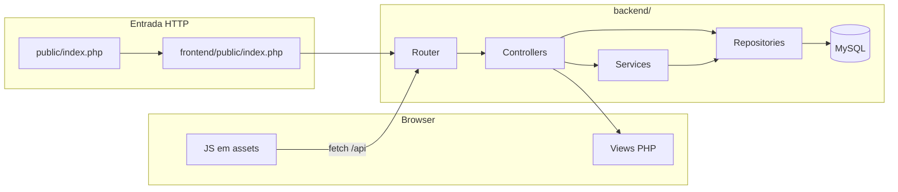

# Plataforma de Lojas

Sistema web **multi-loja** em PHP: numa única instalação convivem várias lojas, cada uma com **vitrine pública** (catálogo, carrinho, checkout), **painel administrativo** e **API JSON** usada pelo JavaScript do painel e da loja.

A arquitetura é em camadas simples (**rotas → controllers → services → repositórios**, PDO no MySQL). **Não usa Composer**: o autoload das classes `App\` está em `backend/bootstrap.php`.

---

## Índice

1. [O que o sistema faz](#o-que-o-sistema-faz)
2. [Arquitetura e fluxo](#arquitetura-e-fluxo)
3. [Requisitos](#requisitos)
4. [Instalação passo a passo](#instalação-passo-a-passo)
5. [Configuração](#configuração)
6. [Estrutura de pastas](#estrutura-de-pastas)
7. [Rotas principais (páginas)](#rotas-principais-páginas)
8. [API REST (resumo)](#api-rest-resumo)
9. [Utilizadores e sessões](#utilizadores-e-sessões)
10. [Base de dados](#base-de-dados)
11. [Ficheiros estáticos e uploads](#ficheiros-estáticos-e-uploads)
12. [Problemas comuns](#problemas-comuns)
13. [Segurança e produção](#segurança-e-produção)
14. [Licença e aviso](#licença-e-aviso)

---

## O que o sistema faz

| Área | Descrição |
|------|-----------|
| **Plataforma** | Login (`/`), lista de lojas (`/lojas`), cadastro de conta (`/criar-conta`), criação de loja (`/criar-loja`), página **Minha conta** (`/minha-conta`) com opção de excluir conta (com restrições se existirem pedidos ou caixa associados). |
| **Vitrine** | URL `/loja/{slug}/…`: vitrine, produto, carrinho, checkout (dinheiro, cartão, PIX), pedido, meus pedidos, meus endereços. Entrega na loja ou entrega com endereços. |
| **Painel** | URL `/painel/{slug}/…`: dashboard, produtos, estoque, entregas (Kanban), PDV, funcionários, clientes, hierarquia de cargos, relatórios (widgets configuráveis), configurações (incl. PIX). |
| **API** | Prefixo `/api/…`: carrinho, checkout/endereços, loja, produtos, imagens, pedidos, pagamentos, caixa, relatórios, metas, utilizadores, cargos, movimentos de stock. |

**PIX:** opcionalmente usa **RapidAPI** para QR Code (`RAPIDAPI_KEY` no `.env`, lido em `backend/config/app.php`). Sem chave, o fluxo PIX depende da implementação atual do projeto.

---

## Arquitetura e fluxo



- **`public/index.php`** (raiz) apenas inclui **`frontend/public/index.php`**, para manter URLs do tipo `…/plataform_stores/public/` no XAMPP sem mudar o DocumentRoot.
- **`frontend/public/index.php`** inicia sessão, define rotas, serve `/assets/…` e `/uploads/…` quando aplicável, e encaminha pedidos para controllers em **`backend/app/`**.
- Constantes **`PLATAFORM_ROOT`** e **`PLATAFORM_BACKEND`** são definidas em `backend/bootstrap.php` (caminhos absolutos para config, views e uploads).

---

## Requisitos

| Componente | Versão / notas |
|------------|------------------|
| PHP | 8.0+ com extensões `pdo_mysql`, `json`, `session`, `fileinfo` (recomendado para validar uploads de imagens) |
| MySQL ou MariaDB | 5.7+ |
| Servidor web | Apache com **`mod_rewrite`** (ex.: XAMPP no Windows) ou equivalente |

---

## Instalação passo a passo

1. Copie a pasta do projeto para `htdocs` (ou o diretório público do seu servidor).
2. Crie a base de dados executando **`backend/database/schema.sql`** no MySQL (phpMyAdmin ou cliente SQL).
3. Execute as migrações em **`backend/database/migrations/`**, **por ordem alfabética dos nomes** (ex.: `add_delivery_and_addresses.sql` antes de `add_delivery_stage_tracking.sql` se ainda não tiver essas tabelas/colunas).
4. Configure **`backend/config/database.php`**: `host`, `dbname`, `username`, `password`, `charset`.
5. Configure **`backend/config/app.php`**: especialmente **`url`** (URL base pública; usada como *fallback* — em muitos casos o sistema infere host e pasta a partir do pedido HTTP).
6. Ajuste **`RewriteBase`** em **`public/.htaccess`** para o caminho **após** `htdocs` (ex.: `/plataform_stores/public/`). Se apontar o DocumentRoot diretamente para **`frontend/public/`**, ajuste também **`frontend/public/.htaccess`** da mesma forma.
7. Opcional: na **raiz do projeto**, crie **`.env`** com `RAPIDAPI_KEY=sua_chave` para PIX via RapidAPI (pode usar `.env.example` como modelo de variáveis — **não commite chaves reais**).
8. Garanta permissão de escrita em **`frontend/public/uploads/products/`** (criada automaticamente em muitos casos ao subir imagens).
9. Aceda no navegador à URL configurada (ex.: `http://localhost/plataform_stores/public/`).

---

## Configuração

### `backend/config/database.php`

Ligação PDO ao MySQL: host, nome da base, utilizador, senha.

### `backend/config/app.php`

| Chave | Função |
|-------|--------|
| `name` | Nome da aplicação |
| `url` | URL base (ex.: `http://localhost/plataform_stores/public`) — *fallback* quando não há `SCRIPT_NAME` útil (ex.: CLI) |
| `timezone` | Fuso horário PHP (ex.: `America/Sao_Paulo`) |
| `debug` | Em produção deve ser `false` |
| `rapidapi_key` | Preenchida a partir da variável de ambiente `RAPIDAPI_KEY` |

### `.env` (raiz do repositório)

Carregado em `backend/bootstrap.php`. Variável típica:

- `RAPIDAPI_KEY` — chave RapidAPI para geração de QR Code PIX.

### Apache (`RewriteBase`)

O valor tem de coincidir com o caminho público da aplicação. Se a URL for `http://localhost/meuprojeto/public/lojas`, o `RewriteBase` costuma ser `/meuprojeto/public/`.

---

## Estrutura de pastas

```
plataform_stores/
├── backend/
│   ├── bootstrap.php          # .env, constantes PLATAFORM_*, autoload App\
│   ├── app/
│   │   ├── Controllers/       # Web + Api/*
│   │   ├── Services/
│   │   ├── Repositories/
│   │   ├── Database/
│   │   ├── Helpers/           # functions.php (config, base_url, redirect, …)
│   │   └── Router.php
│   ├── config/                # app.php, database.php
│   ├── routes/                # web.php, api.php
│   ├── views/                 # layout, login, lojas, store/*, panel/*
│   └── database/
│       ├── schema.sql
│       └── migrations/
├── frontend/public/
│   ├── index.php              # Front controller (rotas, assets, uploads)
│   ├── .htaccess
│   ├── assets/                # css/, js/, favicon
│   └── uploads/               # imagens de produtos (ex.: products/)
├── public/
│   ├── index.php              # require → ../frontend/public/index.php
│   └── .htaccess
├── index.php                  # Opcional: encaminha para public/
├── .env                       # Não versionar (criar localmente)
└── README.md
```

---

## Rotas principais (páginas)

Definição completa em **`backend/routes/web.php`**.

| Método | Caminho | Descrição |
|--------|---------|-----------|
| GET | `/` | Login (redireciona para `/lojas` se já autenticado) |
| POST | `/login` | Autenticação |
| GET | `/sair` | Logout |
| GET | `/lojas` | Lista de lojas (autenticado) |
| GET | `/minha-conta` | Dados da conta |
| POST | `/minha-conta/excluir` | Excluir conta (validações no servidor) |
| GET/POST | `/criar-conta` | Cadastro de utilizador |
| GET/POST | `/criar-loja` | Criar nova loja |
| GET | `/loja/{slug}` | Vitrine |
| GET | `/loja/{slug}/produto/{id}` | Detalhe do produto |
| GET | `/loja/{slug}/carrinho` | Carrinho |
| GET | `/loja/{slug}/checkout` | Checkout |
| GET | `/loja/{slug}/pedido/{id}` | Pedido |
| GET | `/loja/{slug}/meus-pedidos` | Pedidos do cliente |
| GET | `/loja/{slug}/meus-enderecos` | Endereços |
| GET | `/painel/{slug}` | Dashboard do painel |
| GET | `/painel/{slug}/produtos` … | Produtos, estoque, entregas, PDV, funcionários, clientes, hierarquia, relatórios, configurações |

---

## API REST (resumo)

Todas as rotas estão em **`backend/routes/api.php`**. O prefixo no browser é o mesmo da sua instalação (ex.: `…/public/api/loja/minha-loja/...`).

| Grupo | Exemplos de endpoints |
|-------|------------------------|
| Carrinho | `POST …/cart/sync`, `…/cart/clear` |
| Checkout / endereços | `GET/POST/PUT/DELETE …/checkout/addresses` |
| Loja / PIX / dashboard | `GET …/pix-config`, `POST …/pix-config`, `GET/POST …/dashboard-config` |
| Produtos | `GET/POST …/products`, imagens, stock |
| Pedidos | `GET/POST …/orders`, estágios de entrega |
| Pagamentos | `POST …/payments`, confirmação, pendentes |
| Caixa | abrir/fechar turno, movimentos |
| Relatórios | vendas, top produtos, stock baixo, funcionários, receita, clientes |
| Metas | `GET/POST …/goals`, metas da loja e por funcionário |
| Utilizadores e cargos | CRUD de users, roles, hierarquia |
| Stock | listagens de movimentos |

Respostas de erro da API costumam vir em JSON com campo `error`. Pedidos a `/api/` desativam `display_errors` no `index.php` para não corromper JSON.

---

## Utilizadores e sessões

- **Plataforma:** sessão com `logged_user_id`, etc., após login em `/`. Cabeçalho com **Minha conta** e **Sair** quando autenticado.
- **Loja (vitrine):** o mesmo e-mail pode existir em `users` com `store_id` diferentes; na vitrine o contexto é sempre a loja do `slug` na URL.
- **Painel:** acesso de **gerente** ou **funcionário** daquela loja; várias ações da API verificam permissões no controller.

---

## Base de dados

- **Schema inicial:** `backend/database/schema.sql` (cria base `plataform_stores` se usar o script completo).
- **Migrações:** `backend/database/migrations/*.sql` — executar conforme necessidade e ordem dos ficheiros.

Tabelas principais (schema): `stores`, `users`, `products`, `orders`, `payments`, `cash_registers`, `roles`, `employee_roles`, metas (`store_goals`, `employee_goals`), etc.

---

## Ficheiros estáticos e uploads

- CSS/JS: **`frontend/public/assets/`** (servidos pela rota `/assets/…` no `index.php`).
- Imagens de produto: **`frontend/public/uploads/products/`**; caminhos relativos guardados na base (ex.: `products/nome.jpg`).
- Tema claro/escuro: `theme.js` e variáveis CSS em `app.css`.

---

## Problemas comuns

| Sintoma | O que verificar |
|---------|------------------|
| **404** em rotas amigáveis | `mod_rewrite`, `AllowOverride`, `RewriteBase` no `.htaccess` correto |
| **Login não redireciona** | URL com `localhost` vs `127.0.0.1` misturada com `app.url`; buffers de saída; ver `redirect()` e `base_url()` em `backend/app/Helpers/functions.php` |
| **Erro de base de dados** | `backend/config/database.php`, MySQL a correr, schema e migrações aplicados |
| **Imagens de produto não gravam** | Permissões em `frontend/public/uploads/products/` |
| **JSON da API inválido** | Warnings do PHP na resposta — corrigir `debug` e erros no servidor |

---

## Segurança e produção

- Use **HTTPS**, senhas fortes no MySQL, **`debug` => false** em `backend/config/app.php`.
- Não publique **`.env`** nem credenciais no repositório.
- Revise permissões de ficheiros, backups e conformidade (LGPD, pagamentos, termos de uso) antes de uso real.

---

## Licença e aviso

Este repositório é um **projeto de aplicação web** para estudo ou uso próprio. O código é oferecido **como está**, sem garantia de adequação a um caso concreto; quem implanta deve rever segurança, backups e legislação aplicável.
