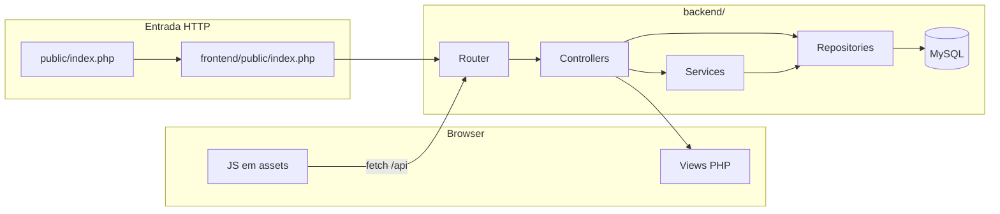

# Plataforma de Lojas

Sistema web **multi-loja** em PHP: numa única instalação convivem várias lojas, cada uma com **vitrine pública** (catálogo, carrinho, checkout), **painel administrativo** e **API JSON** usada pelo JavaScript do painel e da loja.

A arquitetura é em camadas simples (**rotas → controllers → services → repositórios**, PDO no MySQL). **Não usa Composer**: o autoload das classes `App\` está em `backend/bootstrap.php`.

---

## Índice

1. [O que o sistema faz](#o-que-o-sistema-faz)
2. [Arquitetura e fluxo](#arquitetura-e-fluxo)
3. [Requisitos](#requisitos)
4. [Instalação passo a passo](#instalação-passo-a-passo)
5. [Configuração](#configuração)
6. [Estrutura de pastas](#estrutura-de-pastas)
7. [Rotas principais (páginas)](#rotas-principais-páginas)
8. [API REST (resumo)](#api-rest-resumo)
9. [Utilizadores e sessões](#utilizadores-e-sessões)
10. [Base de dados](#base-de-dados)
11. [Ficheiros estáticos e uploads](#ficheiros-estáticos-e-uploads)
12. [Problemas comuns](#problemas-comuns)
13. [Segurança e produção](#segurança-e-produção)
14. [Licença e aviso](#licença-e-aviso)

---

## O que o sistema faz

| Área | Descrição |
|------|-----------|
| **Plataforma** | Login (`/`), lista de lojas (`/lojas`), cadastro de conta (`/criar-conta`), criação de loja (`/criar-loja`), página **Minha conta** (`/minha-conta`) com opção de excluir conta (com restrições se existirem pedidos ou caixa associados). |
| **Vitrine** | URL `/loja/{slug}/…`: vitrine, produto, carrinho, checkout (dinheiro, cartão, PIX), pedido, meus pedidos, meus endereços. Entrega na loja ou entrega com endereços. |
| **Painel** | URL `/painel/{slug}/…`: dashboard, produtos, estoque, entregas (Kanban), PDV, funcionários, clientes, hierarquia de cargos, relatórios (widgets configuráveis), configurações (incl. PIX). |
| **API** | Prefixo `/api/…`: carrinho, checkout/endereços, loja, produtos, imagens, pedidos, pagamentos, caixa, relatórios, metas, utilizadores, cargos, movimentos de stock. |

**PIX:** opcionalmente usa **RapidAPI** para QR Code (`RAPIDAPI_KEY` no `.env`, lido em `backend/config/app.php`). Sem chave, o fluxo PIX depende da implementação atual do projeto.

---

## Arquitetura e fluxo


```mermaid
flowchart LR
  subgraph web [Browser]
    HTML[Views PHP]
    JS[JS em assets]
  end
  subgraph entry [Entrada HTTP]
    P[public/index.php]
    F[frontend/public/index.php]
  end
  subgraph backend [backend/]
    R[Router]
    C[Controllers]
    S[Services]
    REP[Repositories]
    DB[(MySQL)]
  end
  P --> F
  F --> R
  R --> C
  C --> S
  C --> REP
  S --> REP
  REP --> DB
  C --> HTML
  JS -->|fetch /api| R
```

- **`public/index.php`** (raiz) apenas inclui **`frontend/public/index.php`**, para manter URLs do tipo `…/plataform_stores/public/` no XAMPP sem mudar o DocumentRoot.
- **`frontend/public/index.php`** inicia sessão, define rotas, serve `/assets/…` e `/uploads/…` quando aplicável, e encaminha pedidos para controllers em **`backend/app/`**.
- Constantes **`PLATAFORM_ROOT`** e **`PLATAFORM_BACKEND`** são definidas em `backend/bootstrap.php` (caminhos absolutos para config, views e uploads).

---

## Requisitos

| Componente | Versão / notas |
|------------|------------------|
| PHP | 8.0+ com extensões `pdo_mysql`, `json`, `session`, `fileinfo` (recomendado para validar uploads de imagens) |
| MySQL ou MariaDB | 5.7+ |
| Servidor web | Apache com **`mod_rewrite`** (ex.: XAMPP no Windows) ou equivalente |

---

## Instalação passo a passo

1. Copie a pasta do projeto para `htdocs` (ou o diretório público do seu servidor).
2. Crie a base de dados executando **`backend/database/schema.sql`**:

   ```
   mysql -u root < backend/database/schema.sql
   ```

   O `schema.sql` é o **retrato completo** do schema atual e já regista as migrações como aplicadas — uma instalação nova não precisa de mais nada. **Num banco que já existe, não execute este arquivo**; use o passo 3.
3. Confirme (ou atualize) o estado das migrações:

   ```
   php backend/scripts/migrate.php --status    lista o que falta
   php backend/scripts/migrate.php             aplica as pendentes
   ```

   Numa instalação nova deve dizer *0 pendentes*. Antes de aplicar qualquer coisa a um banco com dados, o runner gera sozinho um dump em `storage/backups/`.
4. Configure **`backend/config/database.php`**: `host`, `dbname`, `username`, `password`, `charset`.
5. Configure **`backend/config/app.php`**: especialmente **`url`** (URL base pública; usada como *fallback* — em muitos casos o sistema infere host e pasta a partir do pedido HTTP).
6. Ajuste **`RewriteBase`** em **`public/.htaccess`** para o caminho **após** `htdocs` (ex.: `/plataform_stores/public/`). Se apontar o DocumentRoot diretamente para **`frontend/public/`**, ajuste também **`frontend/public/.htaccess`** da mesma forma.
7. Na **raiz do projeto**, copie **`.env.example`** para **`.env`** e preencha. `APP_DEBUG=true` só na máquina de desenvolvimento; `RAPIDAPI_KEY` e `OPENROUTER_API_KEY` são opcionais. **Nunca commite chaves reais** — o `.env` é ignorado pelo Git e bloqueado por HTTP.
8. Garanta permissão de escrita em **`frontend/public/uploads/products/`** e em **`storage/logs/`** (destino dos erros registados).
9. Opcional, mas recomendado para começar: popule com uma loja de exemplo.

   ```
   php backend/scripts/seed.php
   ```

   Cria uma loja com 7 produtos (3 com matriz de cor/tamanho), categorias da vitrine, metas e três contas — gerente, funcionário e cliente — com senha `gerente123`. **Troque essas senhas** antes de expor a instalação a qualquer rede.
10. Aceda no navegador à URL configurada (ex.: `http://localhost/plataform_stores/public/`).

---

## Configuração

### `backend/config/database.php`

Ligação PDO ao MySQL: host, nome da base, utilizador, senha.

### `backend/config/app.php`

| Chave | Função |
|-------|--------|
| `name` | Nome da aplicação |
| `url` | URL base (ex.: `http://localhost/plataform_stores/public`) — *fallback* quando não há `SCRIPT_NAME` útil (ex.: CLI) |
| `timezone` | Fuso horário PHP (ex.: `America/Sao_Paulo`) |
| `debug` | Lida de `APP_DEBUG` no `.env`. Ausente = `false`. Ligada, junta o campo `debug` às respostas de erro |
| `rapidapi_key` | Preenchida a partir da variável de ambiente `RAPIDAPI_KEY` |

Nenhuma destas chaves se edita no ficheiro: `url` e `debug` vêm do `.env`, para que publicar não dependa de alguém lembrar de alterar um ficheiro versionado.

### `.env` (raiz do repositório)

Carregado em `backend/bootstrap.php`. Use **`.env.example`** como modelo:

| Variável | Função |
|----------|--------|
| `APP_DEBUG` | `true` expõe mensagens de exceção nas respostas e no HTML. **`false` fora de desenvolvimento** |
| `APP_URL` | URL base pública (*fallback*) |
| `DB_NAME`, `DB_HOST`, `DB_USER`, `DB_PASSWORD` | Sobrescrevem `backend/config/database.php`. Útil para apontar a outro banco sem editar arquivo versionado — por exemplo, ensaiar uma migration numa cópia |
| `RAPIDAPI_KEY` | Chave RapidAPI para geração de QR Code PIX (opcional) |
| `OPENROUTER_API_KEY` | Chave do assistente de IA do painel (opcional) |

### Apache (`RewriteBase`)

O valor tem de coincidir com o caminho público da aplicação. Se a URL for `http://localhost/meuprojeto/public/lojas`, o `RewriteBase` costuma ser `/meuprojeto/public/`.

---

## Estrutura de pastas

```
plataform_stores/
├── backend/
│   ├── bootstrap.php          # .env, constantes PLATAFORM_*, autoload App\
│   ├── app/
│   │   ├── Controllers/       # Web + Api/*
│   │   ├── Services/
│   │   ├── Repositories/
│   │   ├── Database/
│   │   ├── Helpers/           # functions.php (config, base_url, redirect, …)
│   │   └── Router.php
│   ├── config/                # app.php, database.php
│   ├── routes/                # web.php, api.php
│   ├── views/                 # layout, login, lojas, store/*, panel/*
│   └── database/
│       ├── schema.sql
│       └── migrations/
├── frontend/public/
│   ├── index.php              # Front controller (rotas, assets, uploads)
│   ├── .htaccess
│   ├── assets/                # css/, js/, favicon
│   └── uploads/               # imagens de produtos (ex.: products/)
├── public/
│   ├── index.php              # require → ../frontend/public/index.php
│   └── .htaccess
├── index.php                  # Opcional: encaminha para public/
├── .env                       # Não versionar (criar localmente)
└── README.md
```

---

## Rotas principais (páginas)

Definição completa em **`backend/routes/web.php`**.

| Método | Caminho | Descrição |
|--------|---------|-----------|
| GET | `/` | Login (redireciona para `/lojas` se já autenticado) |
| POST | `/login` | Autenticação |
| GET | `/sair` | Logout |
| GET | `/lojas` | Lista de lojas (autenticado) |
| GET | `/minha-conta` | Dados da conta |
| POST | `/minha-conta/excluir` | Excluir conta (validações no servidor) |
| GET/POST | `/criar-conta` | Cadastro de utilizador |
| GET/POST | `/criar-loja` | Criar nova loja |
| GET | `/loja/{slug}` | Vitrine |
| GET | `/loja/{slug}/produto/{id}` | Detalhe do produto |
| GET | `/loja/{slug}/carrinho` | Carrinho |
| GET | `/loja/{slug}/checkout` | Checkout |
| GET | `/loja/{slug}/pedido/{id}` | Pedido |
| GET | `/loja/{slug}/meus-pedidos` | Pedidos do cliente |
| GET | `/loja/{slug}/meus-enderecos` | Endereços |
| GET | `/painel/{slug}` | Dashboard do painel |
| GET | `/painel/{slug}/produtos` … | Produtos, estoque, entregas, PDV, funcionários, clientes, hierarquia, relatórios, configurações |

---

## API REST (resumo)

Todas as rotas estão em **`backend/routes/api.php`**. O prefixo no browser é o mesmo da sua instalação (ex.: `…/public/api/loja/minha-loja/...`).

| Grupo | Exemplos de endpoints |
|-------|------------------------|
| Carrinho | `POST …/cart/sync`, `…/cart/clear` |
| Checkout / endereços | `GET/POST/PUT/DELETE …/checkout/addresses` |
| Loja / PIX / dashboard | `GET …/pix-config`, `POST …/pix-config`, `GET/POST …/dashboard-config` |
| Produtos | `GET/POST …/products`, imagens, stock |
| Pedidos | `GET/POST …/orders`, estágios de entrega |
| Pagamentos | `POST …/payments`, confirmação, pendentes |
| Caixa | abrir/fechar turno, movimentos |
| Relatórios | vendas, top produtos, stock baixo, funcionários, receita, clientes |
| Metas | `GET/POST …/goals`, metas da loja e por funcionário |
| Utilizadores e cargos | CRUD de users, roles, hierarquia |
| Stock | listagens de movimentos |

Respostas de erro da API costumam vir em JSON com campo `error`. Pedidos a `/api/` desativam `display_errors` no `index.php` para não corromper JSON.

---

## Utilizadores e sessões

- **Plataforma:** sessão com `logged_user_id`, etc., após login em `/`. Cabeçalho com **Minha conta** e **Sair** quando autenticado. O cookie é `httponly`/`samesite=Lax` e o id é renovado a cada login e logout.
- **Loja (vitrine):** navegar e adicionar ao carrinho não exige conta. **Finalizar compra, ver "Meus pedidos" e "Meus endereços" exigem login** — a identidade sai sempre da sessão, nunca de um parâmetro `email`.
- **Comprovante do pedido:** `/loja/{slug}/pedido/{id}` abre para a equipa da loja, para o dono logado, ou para quem tiver o link com `?t={access_token}`. Sem um dos três, responde 404.
### Permissões

Quem pode o quê está em **`backend/app/Auth/Permissions.php`** — uma matriz de permissões nomeadas por cargo. O modelo é: o **gerente** gerencia a loja; o **funcionário** a opera.

| Área | Gerente | Funcionário |
|------|:-------:|:-----------:|
| Dashboard, PDV, caixa, entregas | ✔ | ✔ |
| Ver catálogo, estoque, pedidos, relatórios, cargos | ✔ | ✔ |
| Criar/editar/apagar produto, ajustar estoque, categorias | ✔ | — |
| Equipe, cargos (gestão), metas | ✔ | — |
| Analyzing BI, configurações, chave PIX | ✔ | — |
| Confirmar pagamento | ✔ | só dinheiro no PDV |

**Toda rota declara o que exige** no terceiro elemento do handler, e o `App\Http\Guard` decide antes de o controller rodar:

```php
'POST /api/loja/{slug}/products' => [ProductApiController::class, 'create', 'store.catalog.write'],
'GET  /loja/{slug}'              => [StoreFrontController::class, 'vitrine', Guard::PUBLICO],
```

Rota sem declaração **não executa**: levanta exceção. Ao criar um endpoint, escolha a permissão na matriz e rode `php backend/tools/routes_check.php`.

Nas views, use `user_can('store.catalog.write', $storeId)` para mostrar ou esconder ações — lembrando que esconder botão não é proteção; a decisão que vale é a do Guard.

### CSRF

Todo `POST`/`PUT`/`PATCH`/`DELETE` exige o token. Nos formulários, `<?= csrf_field() ?>`. No JavaScript nada é preciso: **`assets/js/csrf.js` intercepta `window.fetch`** e envia o cabeçalho `X-CSRF-Token` sozinho — ele é carregado no `<head>` dos três layouts, antes de qualquer script que faça requisição.

Token vencido volta como `403` com o cabeçalho `X-CSRF-Retry`, e o interceptador recarrega a página.

### Limite de tentativas

`App\Auth\RateLimiter` (tabela `rate_limits`): 8 tentativas de login por IP+e-mail a cada 15 minutos, 5 contas por IP por hora, 30 perguntas ao assistente de IA por usuário a cada 10 minutos.

- **Painel:** acesso de **gerente** ou **funcionário** daquela loja, conforme a matriz acima.
### Identidade

**Uma pessoa, uma conta, uma senha.** `users.email` é único globalmente e a tabela guarda só a identidade — nome, e-mail, senha.

O cargo é o **vínculo com a loja**, em `store_members (user_id, store_id, role)`. A mesma pessoa pode ser gerente numa loja, funcionária em outra e cliente numa terceira, com a mesma senha em todas. Quem não tem vínculo nenhum é cliente.

```php
$memberRepo->role($userId, $storeId);        // 'gerente' | 'funcionario' | null
$memberRepo->storeIdsForUser($userId);       // lojas onde a pessoa trabalha
$memberRepo->upsert($userId, $storeId, $r);  // contrata ou muda o cargo
$memberRepo->remove($userId, $storeId);      // demite — a pessoa continua existindo
```

Consequências práticas: **excluir alguém da equipe desfaz o vínculo, não apaga a conta** (ela pode ser cliente de outra loja); **contratar quem já tem conta apenas vincula**, mantendo a senha que a pessoa já usa; e criar uma segunda loja não cria uma segunda conta.

---

## Base de dados

Tabelas principais: `stores`, `users`, `products`, `product_variants`, `orders`, `order_items`, `payments`, `user_addresses`, `cash_registers`, `roles`, `employee_roles`, metas (`store_goals`, `employee_goals`), `schema_migrations`.

### Os dois caminhos

| Situação | O que executar |
|----------|----------------|
| Instalação nova | `mysql -u root < backend/database/schema.sql` — retrato completo, já em dia |
| Banco que já existe | `php backend/scripts/migrate.php` — aplica só o que falta |

Os dois produzem o mesmo schema. Nunca execute o `schema.sql` sobre um banco com dados: ele contém `DROP TABLE IF EXISTS`.

### Scripts

| Comando | Função |
|---------|--------|
| `php backend/scripts/migrate.php` | Aplica as migrações pendentes (faz dump antes, se houver dados) |
| `php backend/scripts/migrate.php --status` | Lista aplicadas e pendentes, sem alterar nada |
| `php backend/scripts/migrate.php --baseline` | Marca todas como aplicadas **sem executar** — para um banco que já recebeu as alterações à mão |
| `php backend/scripts/backup.php [rótulo]` | Dump para `storage/backups/` |
| `php backend/scripts/seed.php [--force]` | Popula com a loja de exemplo |
| `php backend/tools/concurrency_check.php` | Verifica estoque, transações e confirmação de pagamento contra o banco |
| `php backend/tools/routes_check.php` | Confere que toda rota declara uma permissão válida |
| `php backend/tools/authz_check.php` | Exercita a matriz de permissões e o CSRF por HTTP (precisa do seed e do servidor no ar) |
| `php backend/tools/identity_check.php` | Verifica a identidade única: e-mail único, vínculos por loja, sessão estável entre logins |

### Migrações novas

Crie `backend/database/migrations/NNNN_descricao.sql` com o próximo número — a ordem de execução é a alfabética do nome. Sem `DELIMITER` e sem `CREATE PROCEDURE`: `DELIMITER` é diretiva do cliente `mysql`, não do servidor, e migração que a use não pode ser executada por PDO. Para DDL condicional, use o padrão `SET @sql = IF(...); PREPARE stmt FROM @sql; EXECUTE stmt; DEALLOCATE PREPARE stmt;` (veja `0007_stores_banner_path.sql`).

Depois de criar uma migração, regenere o `schema.sql` para que os dois caminhos continuem equivalentes:

```
mysqldump -u root --no-data --skip-comments plataform_stores
```

### Antes de mexer no schema

`log_bin` está desligado no XAMPP por padrão: **não há como desfazer um `DROP`**. Rode `php backend/scripts/backup.php` antes de qualquer operação destrutiva, e teste recriação de schema num banco descartável, nunca no de trabalho. O `migrate.php` já faz o dump sozinho — mas ele só cobre o que passa por ele.

---

## Ficheiros estáticos e uploads

- CSS/JS: **`frontend/public/assets/`** (servidos pela rota `/assets/…` no `index.php`).
- Imagens de produto: **`frontend/public/uploads/products/`**; caminhos relativos guardados na base (ex.: `products/nome.jpg`).
- Tema claro/escuro: `theme.js` e variáveis CSS em `app.css`.

---

## Problemas comuns

| Sintoma | O que verificar |
|---------|------------------|
| **404** em rotas amigáveis | `mod_rewrite`, `AllowOverride`, `RewriteBase` no `.htaccess` correto |
| **Login não redireciona** | URL com `localhost` vs `127.0.0.1` misturada com `app.url`; buffers de saída; ver `redirect()` e `base_url()` em `backend/app/Helpers/functions.php` |
| **Erro de base de dados** | `backend/config/database.php`, MySQL a correr, schema e migrações aplicados |
| **Imagens de produto não gravam** | Permissões em `frontend/public/uploads/products/` |
| **JSON da API inválido** | Warnings do PHP na resposta — corrigir `debug` e erros no servidor |

---

## Segurança e produção

- Use **HTTPS**, senhas fortes no MySQL, **`APP_DEBUG=false`** no `.env`.
- Não publique **`.env`** nem credenciais no repositório.
- **Raiz pública:** aponte o `DocumentRoot` para **`frontend/public/`**. Enquanto o projeto vive dentro de `htdocs`, quem protege `.env`, `backend/`, `storage/`, `docs/` e `.git/` são os `.htaccess` — se mudar de servidor (nginx) ou desligar `AllowOverride`, essa proteção some e o código-fonte volta a ser descarregável.
- **Pagamento é simulação.** Não há gateway: um cartão que passe no Luhn marca o pedido como pago, baixa estoque e conta como receita no BI. Antes de qualquer cobrança real, integre um PSP — ver [docs/AUDITORIA-E-PLANO.md](docs/AUDITORIA-E-PLANO.md).
- **Dívida técnica conhecida e priorizada** está em [docs/AUDITORIA-E-PLANO.md](docs/AUDITORIA-E-PLANO.md). O que ainda falta: identidade duplicada em `users` (uma linha por loja), ausência de Composer e de testes automatizados, e os itens de performance.
- Revise permissões de ficheiros, backups e conformidade (LGPD, pagamentos, termos de uso) antes de uso real.

---

## Licença e aviso

Este repositório é um **projeto de aplicação web** para estudo ou uso próprio. O código é oferecido **como está**, sem garantia de adequação a um caso concreto; quem implanta deve rever segurança, backups e legislação aplicável.
